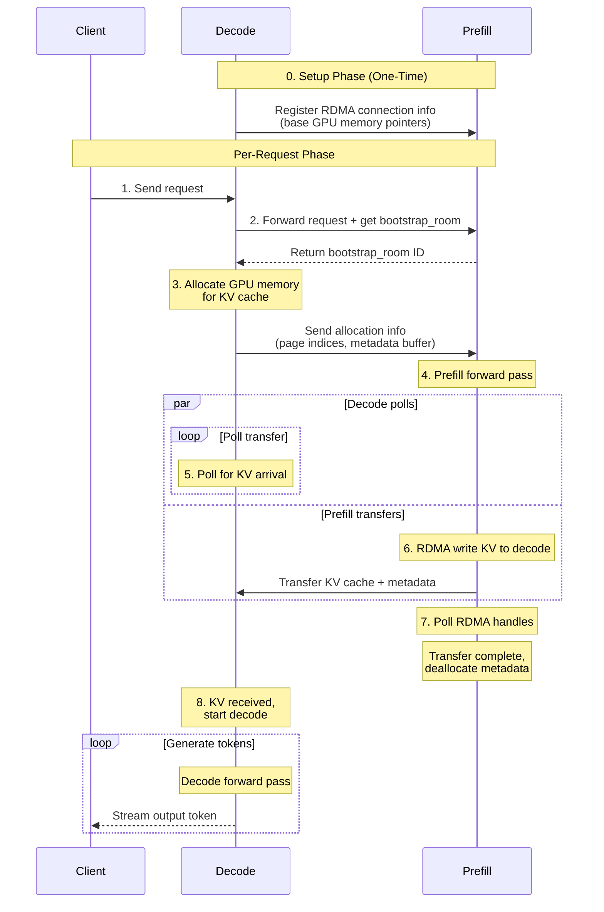

## SGLang Disaggregated KV Transfer Flow

### Overview
In disaggregated serving, prefill and decode workers are separate processes. Prefill computes KV cache for input tokens and transfers it to decode workers via RDMA (using NIXL, Mooncake, or other backends).

### High-Level Summary

0. Init memory pointers at startup
1. Decode receives a request
2. Decode sends the request to prefill
3. Decode **Allocates memory** for the request, sends allocation info to prefill
4. Prefill receives the allocated memory info, starts prefill
5. Decode starts polling for completed kvs
6. Prefill completes, starts copying kvs into decode
7. Prefill polls for completion, deallocates kvs
8. Decode starts processing




## Detailed flow

### Setup phase
This happens once when prefill and decode workers first start up and establish connections.

#### Decode Registers with Prefill

**File:** `sglang/srt/disaggregation/nixl/conn.py`

When a `NixlKVReceiver` is created for the first time (or when connecting to a new prefill worker), it registers its RDMA connection info:

```python
# NixlKVReceiver._register_kv_args()
def _register_kv_args(self):
    # Send to prefill's bootstrap server
    sock.send_multipart([
        GUARD,
        "None",  # ⚠️ Special value: this is registration, not a request
        self.kv_mgr.local_ip,
        self.kv_mgr.rank_port,
        self.kv_mgr.agent.name,  # NIXL agent name
        self.kv_mgr.agent.get_agent_metadata(),  # RDMA connection metadata
        packed_kv_data_ptrs,  # Base GPU memory pointers for KV cache
        packed_aux_data_ptrs,  # Base memory pointers for metadata buffers
        gpu_id,
    ])
```

**File:** `sglang/srt/disaggregation/nixl/conn.py`

Prefill receives and stores this info:

```python
# NixlKVManager.bootstrap_thread()
def bootstrap_thread():
    while True:
        msg = self.server_socket.recv_multipart()
        room = msg[0].decode("ascii")
        agent_name = msg[3].decode("ascii")

        if room == "None":  # ⚠️ This is a registration message
            # Save decode's RDMA connection info
            self._add_remote_peer(KVArgsRegisterInfo.from_zmq(msg))

            # Establish RDMA peer connection
            self.agent.add_remote_agent(decode_metadata)

            logger.debug(f"Registered {agent_name} successfully")
            continue  # Not a request, just setup
```

**What gets stored:**
- RDMA peer connection info
- Base GPU memory pointers for decode's KV cache buffers
- Base memory pointers for decode's metadata buffers

This allows prefill to later do direct RDMA writes to decode's memory.

### Per-Request Phase


#### 1. Client → Decode Worker

**File:** `dynamo/sglang/request_handlers/decode_handler.py`

```python
async def generate(request: dict):
    # Send request to prefill worker via RPC
    prefill_stream = await self.prefill_client.generate(
        DisaggPreprocessedRequest(request, sampling_params).model_dump()
    )
```

#### 2. Prefill Returns Bootstrap Info (First Response)

**File:** `sglang/srt/managers/scheduler.py` (prefill)

```python
def process_input_requests(reqs):
    for req in reqs:
        req.bootstrap_room = generate_unique_id()

        # Stream bootstrap info immediately
        stream_output([{
            "bootstrap_host": self.local_ip,
            "bootstrap_port": self.bootstrap_port,
            "bootstrap_room": req.bootstrap_room,
        }])

        # Add to bootstrap queue for handshake
        self.disagg_prefill_bootstrap_queue.add(req)
```

#### 3. Decode Creates KVReceiver

**File:** `dynamo/sglang/request_handlers/decode_handler.py`

```python
    # Wait for bootstrap info (contains unique room ID for this request)
    async for info in prefill_stream:
        bootstrap_info = info.data()
        break

    # Pass to engine
    decode = await self.engine.async_generate(
        **input_param,
        stream=True,
        bootstrap_host=bootstrap_info["bootstrap_host"],
        bootstrap_port=bootstrap_info["bootstrap_port"],
        bootstrap_room=bootstrap_info["bootstrap_room"],  # Unique ID for this request
    )
```

**File:** `sglang/srt/disaggregation/decode.py`

```python
class DecodePreallocQueue:
    def add(self, req):
        # Create receiver for this specific request
        kv_receiver = NixlKVReceiver(
            mgr=self.kv_manager,  # Uses already-registered RDMA connection
            bootstrap_addr=f"{req.bootstrap_host}:{req.bootstrap_port}",
            bootstrap_room=req.bootstrap_room,  # Unique room ID
        )
        self.queue.append(DecodeRequest(req, kv_receiver))
```

#### 4. Decode Allocates Memory

**File:** `sglang/srt/disaggregation/decode.py`

Decode's event loop polls requests and allocates memory when ready:

```python
# DecodePreallocQueue.pop_preallocated()
def pop_preallocated():
    for decode_req in self.queue:
        if decode_req.waiting_for_input:
            # Allocate GPU memory for KV cache
            kv_loc = token_to_kv_pool.alloc(len(req.origin_input_ids))

            # Allocate metadata buffer slot
            decode_req.metadata_buffer_index = allocator.alloc()

            # Get the allocated indices
            kv_indices = req_to_token_pool[req.req_pool_idx][:input_len]
            page_indices = kv_to_page_indices(kv_indices, page_size)

            # Send allocation info to prefill
            decode_req.kv_receiver.init(page_indices, decode_req.metadata_buffer_index)

            preallocated_reqs.append(decode_req)
```

#### 5. Decode Sends Allocation Info to Prefill

**File:** `sglang/srt/disaggregation/nixl/conn.py`

Decode tells prefill exactly where to write the KV cache:

```python
# NixlKVReceiver.init()
def init(self, kv_indices, aux_index):
    sock.send_multipart([
        GUARD,
        str(bootstrap_room),  # ⚠️ NOT "None" - this is the request's room ID
        self.kv_mgr.local_ip,
        str(self.kv_mgr.rank_port),
        self.kv_mgr.agent.name,
        kv_indices.tobytes(),  # Where to write KV data (specific page indices)
        str(aux_index),  # Where to write metadata (buffer index)
        str(required_dst_info_num),  # How many decode TP ranks to expect
    ])
```

**File:** `sglang/srt/disaggregation/nixl/conn.py`

Prefill receives this and stores the allocation info:

```python
# NixlKVManager.bootstrap_thread() - continued from setup phase
def bootstrap_thread():
    while True:
        msg = self.server_socket.recv_multipart()
        room = msg[0].decode("ascii")

        if room == "None":
            # ... setup phase (already covered) ...
            continue

        # This is allocation info for a specific request!
        room = int(room)
        if room not in self.transfer_infos:
            self.transfer_infos[room] = {}

        # Store decode's allocation info for this request
        self.transfer_infos[room][agent_name] = TransferInfo.from_zmq(msg)

        # Check if all decode TP ranks have sent their allocation info
        required_dst_info_num = self.transfer_infos[room][agent_name].required_dst_info_num

        if len(self.transfer_infos[room]) == required_dst_info_num:
            # All decode workers ready!
            self.update_status(room, KVPoll.WaitingForInput)
```

#### 6. Prefill Detects Allocation Complete

**File:** `sglang/srt/disaggregation/prefill.py`

```python
# PrefillBootstrapQueue.pop_bootstrapped()
def pop_bootstrapped():
    polls = poll_and_all_reduce([req.disagg_kv_sender for req in self.queue])

    for req, poll in zip(self.queue, polls):
        if poll == KVPoll.WaitingForInput:  # ✅ Decode allocated!
            # Allocate our own metadata buffer
            req.metadata_buffer_index = allocator.alloc()

            # Initialize sender with number of pages to send
            num_pages = kv_to_page_num(len(req.origin_input_ids), page_size)
            req.disagg_kv_sender.init(num_pages, req.metadata_buffer_index)

            # Move to waiting queue for prefill
            bootstrapped_reqs.append(req)
```

#### 7. Prefill Runs Forward Pass

**File:** `sglang/srt/disaggregation/prefill.py`

```python
def event_loop_normal_disagg_prefill():
    while True:
        recv_reqs = self.recv_requests()
        self.process_input_requests(recv_reqs)

        # Bootstrap → Waiting (from step 6)
        self.waiting_queue.extend(
            self.disagg_prefill_bootstrap_queue.pop_bootstrapped()
        )

        # Run prefill
        batch = self.get_new_batch_prefill()
        if batch:
            result = self.run_batch(batch)  # 🔥 Forward pass
            self.process_batch_result_disagg_prefill(batch, result)
```

#### 8. Prefill Sends KV via RDMA

**File:** `sglang/srt/disaggregation/prefill.py`

```python
def process_batch_result_disagg_prefill(batch, result):
    for req in batch.reqs:
        if req.is_chunked <= 0:  # Prefill done
            self.disagg_prefill_inflight_queue.append(req)
            self.send_kv_chunk(req, last_chunk=True)

def send_kv_chunk(req, last_chunk=False):
    kv_indices = self.req_to_token_pool.req_to_token[req.req_pool_idx, start:end]
    page_indices = kv_to_page_indices(kv_indices, page_size)

    if last_chunk:
        self.disagg_metadata_buffers.set_buf(req)  # Write metadata

    req.disagg_kv_sender.send(page_indices)  # RDMA transfer
```

**File:** `sglang/srt/disaggregation/nixl/conn.py`

```python
# NixlKVSender.send()
def send(self, kv_indices):
    xfer_handles = self.kv_mgr.add_transfer_request(
        bootstrap_room, kv_indices, is_last, aux_index
    )
    self.xfer_handles.extend(xfer_handles)

# NixlKVManager.send_kvcache()
def send_kvcache(...):
    # Prepare RDMA descriptors
    for layer_id in range(num_layers):
        src_addr = prefill_kv_ptr + prefill_idx * item_len
        dst_addr = decode_kv_ptr + decode_idx * item_len
        src_addrs.append((src_addr, length, gpu_id))
        dst_addrs.append((dst_addr, length, gpu_id))

    # Execute RDMA write
    xfer_handle = self.agent.initialize_xfer(
        "WRITE", src_descs, dst_descs, peer_name, notif
    )
    self.agent.transfer(xfer_handle)
    return xfer_handle
```

#### 9. Decode Polls for Transfer Completion

**File:** `sglang/srt/disaggregation/decode.py`

```python
def event_loop_normal_disagg_decode():
    while True:
        recv_reqs = self.recv_requests()
        self.process_input_requests(recv_reqs)
        self.process_decode_queue()  # Poll transfers

        batch = self.get_next_disagg_decode_batch_to_run()
        if batch:
            result = self.run_batch(batch)

def process_decode_queue():
    req_conns = self.disagg_decode_prealloc_queue.pop_preallocated()
    self.disagg_decode_transfer_queue.extend(req_conns)

    alloc_reqs = self.disagg_decode_transfer_queue.pop_transferred()
    self.waiting_queue.extend(alloc_reqs)
```

**File:** `sglang/srt/disaggregation/decode.py`

```python
# DecodeTransferQueue.pop_transferred()
def pop_transferred():
    polls = poll_and_all_reduce([req.kv_receiver for req in self.queue])

    for decode_req, poll in zip(self.queue, polls):
        if poll == KVPoll.Success:  # ✅ Transfer done!
            idx = decode_req.metadata_buffer_index
            (output_id, logprobs, ...) = self.metadata_buffers.get_buf(idx)
            decode_req.req.output_ids.append(output_id)
            transferred_reqs.append(decode_req.req)
```

**File:** `sglang/srt/disaggregation/nixl/conn.py`

```python
# NixlKVReceiver.poll()
def poll():
    self.kv_mgr.update_transfer_status()
    if self.kv_mgr.check_transfer_done(self.bootstrap_room):
        return KVPoll.Success

# NixlKVManager.update_transfer_status()
def update_transfer_status():
    notif_map = self.agent.get_new_notifs()  # RDMA notifications

    for msg in messages:
        room, chunk_id, is_last = parse(msg)
        self.transfer_statuses[room].received_kvs.add(chunk_id)
        if is_last:
            self.transfer_statuses[room].num_kvs_expected = chunk_id + 1
        if "aux" in msg:
            self.transfer_statuses[room].received_aux = True
```

#### 10. Prefill Polls and Deallocates

**File:** `sglang/srt/disaggregation/prefill.py`

```python
def process_disagg_prefill_inflight_queue():
    polls = poll_and_all_reduce([req.disagg_kv_sender for req in inflight_queue])

    for req, poll in zip(inflight_queue, polls):
        if poll == KVPoll.Success:  # ✅ RDMA complete!
            self.tree_cache.cache_finished_req(req)
            req.finished_reason = FINISH_LENGTH(length=0)
            self.stream_output([req])
            self.req_to_metadata_buffer_idx_allocator.free(req.metadata_buffer_index)
            done_reqs.append(req)
```

**File:** `sglang/srt/disaggregation/nixl/conn.py`

```python
# NixlKVSender.poll()
def poll():
    # Check RDMA transfer handles
    states = [self.kv_mgr.agent.check_xfer_state(h) for h in self.xfer_handles]

    if all([s == "DONE" for s in states]):
        return KVPoll.Success  # ✅

    return KVPoll.WaitingForInput
```

#### 11. Decode Runs Generation

**File:** `sglang/srt/disaggregation/decode.py`

```python
def get_next_disagg_decode_batch_to_run():
    new_prebuilt_batch = self.get_new_prebuilt_batch()
    if new_prebuilt_batch:
        new_prebuilt_batch.prepare_for_prebuilt_extend()  # Skip prefill forward
        return new_prebuilt_batch
    else:
        return self.update_running_batch(self.running_batch)
```

**File:** `dynamo/sglang/request_handlers/decode_handler.py`

```python
    async for out in self._process_token_stream(decode):
        yield out  # Stream tokens to client
```
