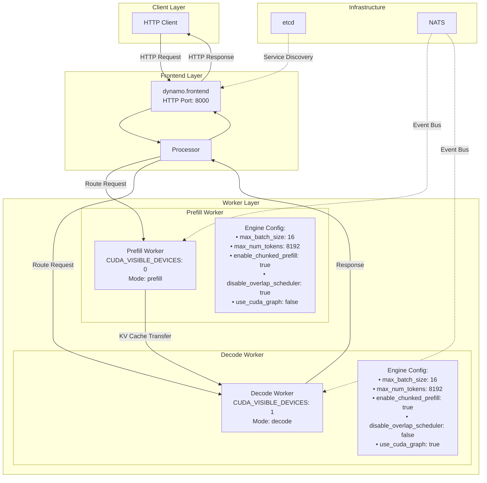
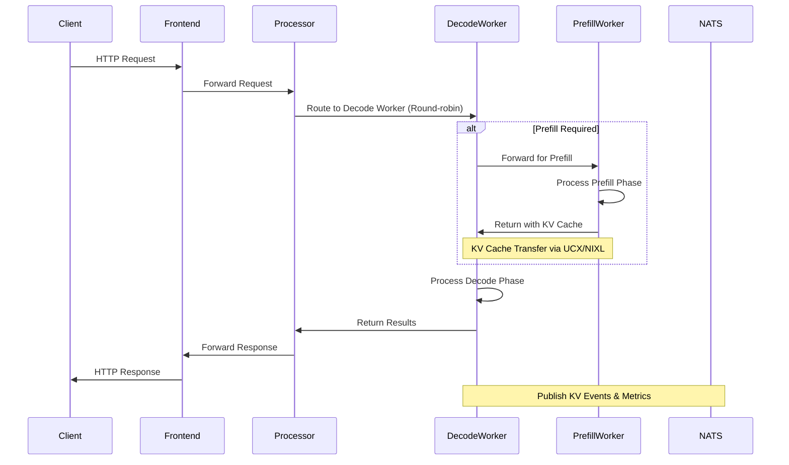
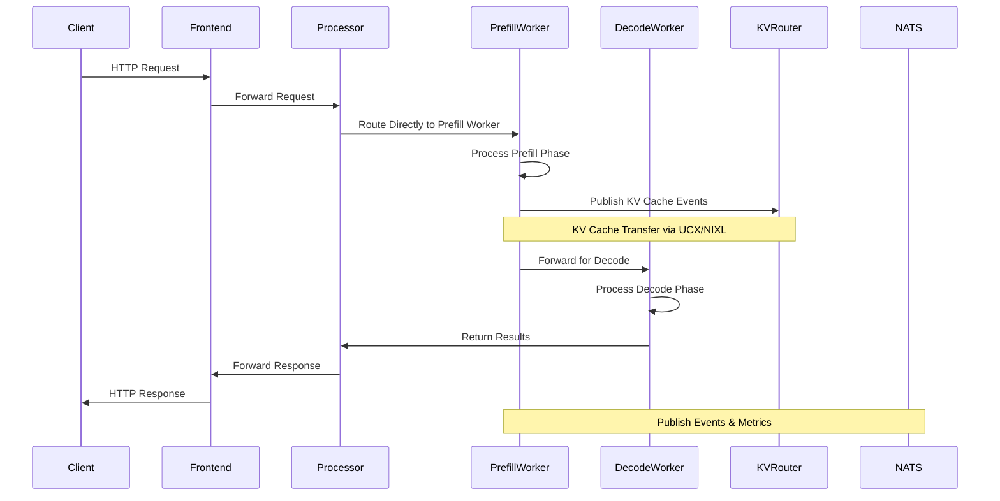
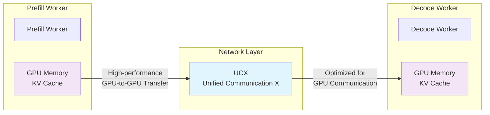
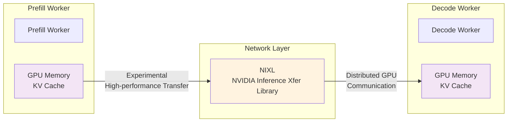
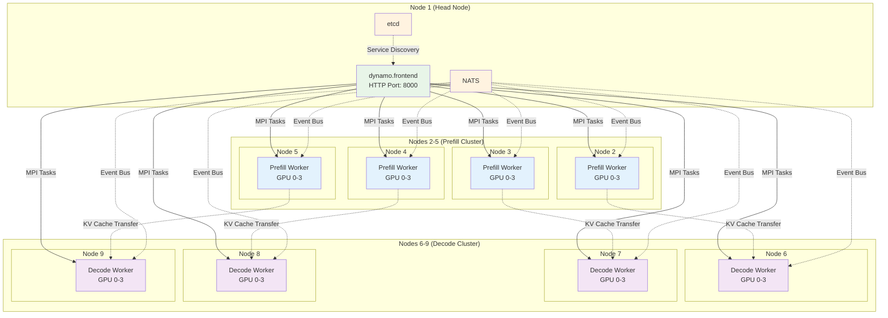
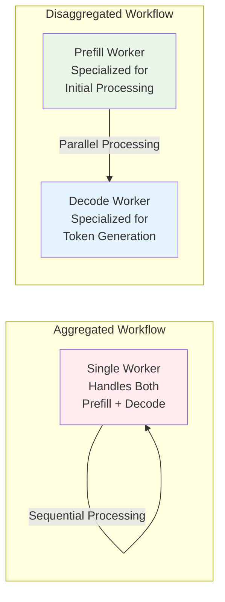

# TensorRT-LLM Disaggregated Workflow Diagram

This document provides comprehensive diagrams demonstrating the disaggregated workflow for TensorRT-LLM backend in Dynamo.

## Overview

The disaggregated workflow separates LLM inference into two specialized workers:
- **Prefill Worker**: Handles the initial processing of input tokens (prefill phase)
- **Decode Worker**: Handles the generation of subsequent tokens (decode phase)

This separation allows for optimized resource allocation and improved throughput.

## 1. Basic Disaggregated Architecture



## 2. Disaggregation Strategies

### 2.1 Decode-First Strategy (Default)



### 2.2 Prefill-First Strategy (with KV Routing)



## 3. KV Cache Transfer Mechanisms

### 3.1 UCX (Default Method)



### 3.2 NIXL (Experimental Method)



## 4. Multi-Node Disaggregated Deployment



## 5. Request Flow Comparison

### 5.1 Aggregated vs Disaggregated



## 6. Configuration Examples

### 6.1 Environment Variables

```bash
# Basic Disaggregated Setup
export MODEL_PATH="deepseek-ai/DeepSeek-R1-Distill-Llama-8B"
export SERVED_MODEL_NAME="deepseek-ai/DeepSeek-R1-Distill-Llama-8B"
export DISAGGREGATION_STRATEGY="decode_first"  # or "prefill_first"
export PREFILL_ENGINE_ARGS="engine_configs/prefill.yaml"
export DECODE_ENGINE_ARGS="engine_configs/decode.yaml"
export PREFILL_CUDA_VISIBLE_DEVICES="0"
export DECODE_CUDA_VISIBLE_DEVICES="1"

# Multi-Node Setup
export NUM_PREFILL_NODES=4
export NUM_DECODE_NODES=4
export NUM_GPUS_PER_NODE=4

# KV Cache Transfer Method
export TRTLLM_USE_NIXL_KVCACHE=1  # For NIXL (experimental)
# export TRTLLM_USE_UCX_KVCACHE=1  # For UCX (default)
```

### 6.2 Launch Commands

```bash
# Basic Disaggregated
./launch/disagg.sh

# Disaggregated with KV Routing
./launch/disagg_router.sh

# Multi-Node Disaggregated
./multinode/srun_disaggregated.sh
```

## 7. Performance Considerations

### 7.1 Resource Allocation

- **Prefill Worker**: Optimized for batch processing with larger memory allocation
- **Decode Worker**: Optimized for single-token generation with CUDA graphs enabled
- **KV Cache Transfer**: High-bandwidth network connection between workers

### 7.2 Scaling Strategies

- **Horizontal Scaling**: Add more prefill/decode workers
- **Vertical Scaling**: Increase GPU memory and compute resources per worker
- **Hybrid Scaling**: Combine both approaches for optimal performance

### 7.3 Monitoring

- **Throughput**: Requests per second
- **Latency**: End-to-end response time
- **KV Cache Hit Rate**: Efficiency of cache reuse
- **GPU Utilization**: Resource usage across workers 