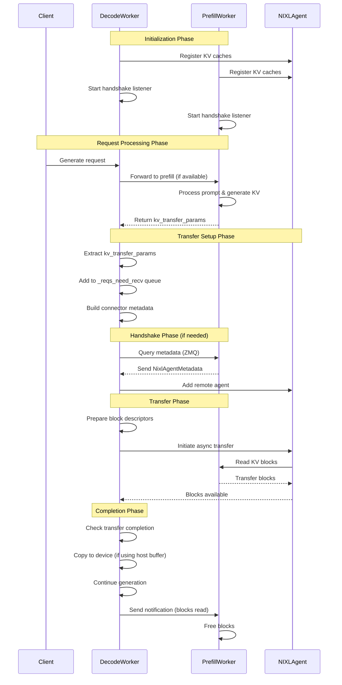

# vLLM KV Transfer Codepath

## High-Level Overview

Here's an overview of vllm's kv transfer protocol. In contrast to sglang, decode copies the kv cache in directly.

### Main Flow:

0. **Initial Setup**: Workers initialize NIXL agents and listen for handshake requests
1. **Request Arrival**: A decode worker receives a generation request
2. **Prefill Delegation**: Decode worker sends the request to a prefill worker for prompt processing
3. **Prefill Execution**: Prefill worker processes the prompt and generates KV cache
4. **Metadata Exchange**: Prefill worker returns KV transfer parameters to decode worker
5. **Handshake**: Decode and prefill workers perform NIXL handshake if not already connected
6. **KV Transfer**: Decode worker asynchronously reads KV blocks from prefill worker
7. **Generation**: Decode worker continues generation using the transferred KV cache

## Mermaid Diagram



## Detailed Codepath Breakdown

### Stage 1: Request Reception and Prefill Delegation

**File:** `components/src/dynamo/vllm/handlers.py`

```python
# Lines 164-259
class DecodeWorkerHandler(BaseWorkerHandler):
    async def generate(self, request, context):
        # Check if prefill workers are available
        if self.can_prefill:
            # Prepare prefill request with KV transfer params
            prefill_sampling_params.extra_args["kv_transfer_params"] = {
                "do_remote_decode": True,
            }

            # Send to prefill worker
            prefill_response = await anext(
                await self.prefill_worker_client.round_robin(
                    prefill_request, context=context
                )
            )

            # Extract KV transfer params from response
            prefill_response = MyRequestOutput.model_validate_json(
                prefill_response.data()
            )

            # Add params to decode sampling_params
            sampling_params.extra_args[
                "kv_transfer_params"
            ] = prefill_response.kv_transfer_params
```

### Stage 2: Request Object Creation

**File:** `.venv/lib/python3.12/site-packages/vllm/v1/request.py`

```python
# Lines 61-78
class Request:
    def __init__(self, ...):
        # Extract KV transfer params from sampling params
        if sampling_params.extra_args is not None:
            self.kv_transfer_params = \
                sampling_params.extra_args.get("kv_transfer_params")
```

### Stage 3: Scheduler Processing

**File:** `.venv/lib/python3.12/site-packages/vllm/distributed/kv_transfer/kv_connector/v1/nixl_connector.py`

```python
# Lines 286-334
class NixlConnectorScheduler:
    def update_state_after_alloc(self, request: "Request",
                                 blocks: "KVCacheBlocks",
                                 num_external_tokens: int):
        params = request.kv_transfer_params

        if params.get("do_remote_prefill"):
            if params.get("remote_block_ids"):
                # Add to receive queue
                local_block_ids = (blocks.get_unhashed_block_ids()
                                  if num_external_tokens > 0 else [])
                self._reqs_need_recv[request.request_id] = (
                    request, local_block_ids)

            # Mark as processed
            params["do_remote_prefill"] = False
```

### Stage 4: Building Connector Metadata

**File:** `.venv/lib/python3.12/site-packages/vllm/distributed/kv_transfer/kv_connector/v1/nixl_connector.py`

```python
# Lines 335-367
class NixlConnectorScheduler:
    def build_connector_meta(self, scheduler_output: SchedulerOutput) -> KVConnectorMetadata:
        meta = NixlConnectorMetadata()

        # Process queued requests
        for req_id, (req, block_ids) in self._reqs_need_recv.items():
            meta.add_new_req(
                request_id=req_id,
                local_block_ids=block_ids,
                kv_transfer_params=req.kv_transfer_params,
            )

        # Clear queue after processing
        self._reqs_need_recv.clear()
        return meta
```

**File:** `.venv/lib/python3.12/site-packages/vllm/v1/core/sched/scheduler.py`

```python
# Lines 583-585
# Attach metadata to scheduler output
if self.connector is not None:
    meta = self.connector.build_connector_meta(scheduler_output)
    scheduler_output.kv_connector_metadata = meta
```

### Stage 5: Model Runner Execution

**File:** `.venv/lib/python3.12/site-packages/vllm/v1/worker/gpu_model_runner.py`

```python
# Lines 1600-1617
def execute_model(self, scheduler_output: "SchedulerOutput", ...):
    # Setup KV connector context
    with self.maybe_get_kv_connector_output(
            scheduler_output) as kv_connector_output:
        model_output = self.model(
            input_ids=input_ids,
            positions=positions,
            intermediate_tensors=intermediate_tensors,
            inputs_embeds=inputs_embeds,
            **model_kwargs,
        )
```

**File:** `.venv/lib/python3.12/site-packages/vllm/v1/worker/kv_connector_model_runner_mixin.py`

```python
# Lines 87-91
@contextmanager
def _get_kv_connector_output(scheduler_output: "SchedulerOutput", ...):
    # Bind metadata and start loading
    get_kv_transfer_group().bind_connector_metadata(
        scheduler_output.kv_connector_metadata)
    get_kv_transfer_group().start_load_kv(forward_context)
```

### Stage 6: NIXL Handshake (if needed)

**File:** `.venv/lib/python3.12/site-packages/vllm/distributed/kv_transfer/kv_connector/v1/nixl_connector.py`

```python
# Lines 585-632
def _nixl_handshake(self, host: str, port: int,
                    remote_tp_size: int, expected_engine_id: str):
    # Query remote worker for metadata
    path = make_zmq_path("tcp", host, port + p_remote_rank)
    with zmq_ctx(zmq.REQ, path) as sock:
        sock.send(GET_META_MSG)
        metadata_bytes = sock.recv()
        metadata = decoder.decode(metadata_bytes)

        # Register remote agent
        remote_agent_name = self.add_remote_agent(
            metadata, p_remote_rank, remote_tp_size)

    return {p_remote_rank: remote_agent_name}

# Lines 558-584
def _nixl_handshake_listener(metadata: NixlAgentMetadata, ...):
    # Listen for handshake requests
    with zmq_ctx(zmq.ROUTER, path) as sock:
        while True:
            identity, _, msg = sock.recv_multipart()
            if msg == GET_META_MSG:
                sock.send_multipart((identity, b"", encoded_data))
```

### Stage 7: KV Block Transfer

**File:** `.venv/lib/python3.12/site-packages/vllm/distributed/kv_transfer/kv_connector/v1/nixl_connector.py`

```python
# Lines 1109-1139
def start_load_kv(self, metadata: NixlConnectorMetadata):
    for req_id, meta in metadata.reqs_to_recv.items():
        remote_engine_id = meta.remote_engine_id

        # Check if handshake needed
        if remote_engine_id not in self._remote_agents:
            self._background_nixl_handshake(
                req_id, remote_engine_id, meta)
            continue

        # Start async transfer
        self._read_blocks_for_req(req_id, meta)

# Lines 1152-1246
def _read_blocks(self, local_block_ids: list[int],
                remote_block_ids: list[int], dst_engine_id: str,
                request_id: str):
    # Handle full prefix cache hit
    if len(local_block_ids) == 0:
        # Just notify remote worker
        self.nixl_wrapper.send_notif(agent_name, notif_msg=notif_id)
        return

    # Prepare block descriptors
    local_block_descs_ids = self._get_block_descs_ids(
        self.engine_id, local_block_ids)
    remote_block_descs_ids = self._get_block_descs_ids(
        dst_engine_id, remote_block_ids)

    # Initiate async transfer
    handle = self.nixl_wrapper.make_prepped_xfer(
        "READ",
        local_xfer_side_handle,
        local_block_descs_ids,
        remote_xfer_side_handle,
        remote_block_descs_ids,
        notif_msg=notif_id,
    )

    self.nixl_wrapper.transfer(handle)

    # Track for completion checking
    self._recving_transfers[request_id].append(
        (handle, time.perf_counter()))
```

### Stage 8: Transfer Completion and Cleanup

**File:** `.venv/lib/python3.12/site-packages/vllm/distributed/kv_transfer/kv_connector/v1/nixl_connector.py`

```python
# Lines 1019-1054
def get_finished(self) -> tuple[set[str], set[str]]:
    # Check for completed transfers
    done_sending = self._get_new_notifs()
    done_recving = self._pop_done_transfers(self._recving_transfers)

    # Copy to device if using host buffer
    if self.use_host_buffer:
        for req_id in done_recving:
            meta = self._recving_metadata.pop(req_id)
            self.sync_recved_kv_to_device(req_id, meta)

    return done_sending, done_recving

# Lines 989-1003
def sync_recved_kv_to_device(self, req_id: str, meta: ReqMeta):
    # Copy from host buffer to device
    self.copy_blocks(self.host_xfer_buffers, self.device_kv_caches,
                     local_block_ids, local_block_ids, "h2d")
```

## Key Components

1. **NIXL Agent**: Low-level networking agent for efficient KV cache transfers
2. **NixlConnector**: High-level coordinator managing the transfer lifecycle
3. **NixlConnectorScheduler**: Scheduler-side logic for request tracking
4. **NixlConnectorWorker**: Worker-side logic for actual transfers
5. **ZMQ Side Channel**: Used for metadata exchange and handshakes
6. **Host Buffer**: Optional CPU buffer for devices not directly supported by NIXL

## Important Notes

- Transfers are asynchronous and non-blocking
- Supports heterogeneous tensor parallelism (different TP sizes for prefill/decode)
- Handles both full and partial prefix cache hits
- Includes timeout mechanism for expired requests
- Supports both device-to-device and host-buffered transfers

