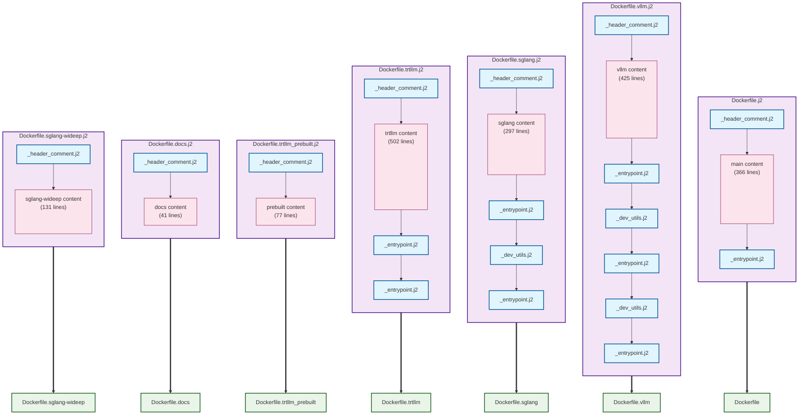

# Dockerfile Templates

This directory contains Jinja2 templates for generating Dockerfiles. The templating system allows for modular, maintainable Dockerfile generation with shared components and standardized headers.

## Dockerfile Composition



## Overview

The `gen_dockerfiles.py` script processes `.j2` template files and generates corresponding Dockerfiles in `/tmp` (or a specified output directory). It also provides comparison functionality to verify that generated files match their originals in the `container/` directory.

## Usage

```bash
# Generate all Dockerfiles and compare with originals (default output-dir: /tmp)
python3 gen_dockerfiles.py --compare-ignore-whitespaces

# Generate and perform strict comparison with detailed differences
python3 gen_dockerfiles.py --compare-strict --show-differences

# Generate to specific output directory
python3 gen_dockerfiles.py --output-dir /path/to/output

# Generate without comparison (default output-dir: /tmp)
python3 gen_dockerfiles.py
```

## Template Structure

### Main Templates
- `Dockerfile.j2` - Main Dockerfile template
- `Dockerfile.vllm.j2` - vLLM variant
- `Dockerfile.sglang.j2` - SGLang variant
- `Dockerfile.trtllm.j2` - TensorRT-LLM variant
- `Dockerfile.docs.j2` - Documentation build
- `Dockerfile.sglang-wideep.j2` - SGLang with Wideep
- `Dockerfile.trtllm_prebuilt.j2` - Prebuilt TensorRT-LLM

### Template Fragments
Template fragments (files with `._` in the name) are reusable components that are included by main templates but not generated as standalone Dockerfiles:

- `Dockerfile._header_comment.j2` - Standardized header with syntax directive and SPDX license
- `Dockerfile._dev_utils.j2` - Common development utilities installation

### Master Template (Future)
- `Dockerfile_master.j2` - Conditional template that can generate different variants based on `dockerfile_type` variable

## Template Features

### Standardized Headers
All templates include the standardized header via:
```jinja2

```

This ensures consistent syntax directives and SPDX license headers across all generated Dockerfiles.

### Modular Components
Common sections are extracted into reusable fragments:
```jinja2

```

### Conditional Logic
Templates use Jinja2 conditionals for dynamic content:
```jinja2

# Development-specific content

```


## Comparison Logic

The script provides two comparison modes:

### `--compare-ignore-whitespaces` (Lenient Comparison)
- Normalizes all whitespace and removes blank lines
- Ignores template header comments (`# TEMPLATE:` lines)
- Ideal for verifying content equivalence regardless of formatting
- Uses Unix `diff` for detailed output when files differ

### `--compare-strict` (Strict Comparison)
- Preserves all whitespace differences (spaces, tabs, newlines)
- Only ignores template header comments (`# TEMPLATE:` lines)
- Detects formatting differences like missing newlines at end of files
- Useful for ensuring exact file formatting matches

### Common Features
- Both modes filter out auto-generated `# TEMPLATE:` header comments
- Provide clear success/failure indicators with colored output
- Support `--show-differences` flag for detailed diff output
- When both flags are used together, `--compare-strict` takes precedence

## File Filtering

The generator automatically skips template fragments (files containing `._` in the filename) during generation and comparison, ensuring only complete Dockerfiles are processed.

## Maintenance

To modify Dockerfiles:
1. Edit the corresponding `.j2` template file
2. Run `python3 gen_dockerfiles.py --compare-ignore-whitespaces` to verify content changes
3. Optionally run `python3 gen_dockerfiles.py --compare-strict --show-differences` to check formatting
4. Copy generated files from `/tmp` to `container/` if needed
5. Commit both template and generated files

### Comparison Workflow Recommendations
- Use `--compare-ignore-whitespaces` for content verification during development
- Use `--compare-strict --show-differences` before final commits to see exact formatting differences
- The `--show-differences` flag is especially useful with strict comparison to identify specific whitespace issues

