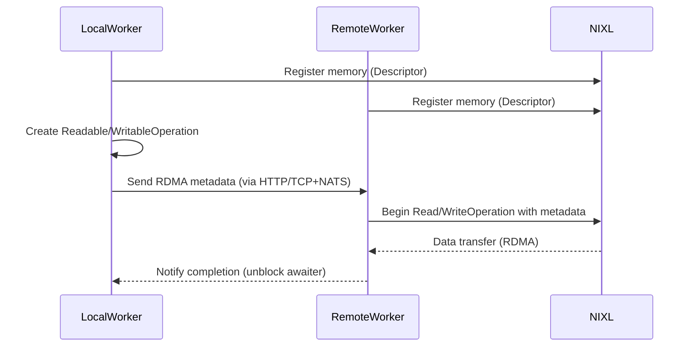

<!--
SPDX-FileCopyrightText: Copyright (c) 2025 NVIDIA CORPORATION & AFFILIATES. All rights reserved.
SPDX-License-Identifier: Apache-2.0

Licensed under the Apache License, Version 2.0 (the "License");
you may not use this file except in compliance with the License.
You may obtain a copy of the License at

http://www.apache.org/licenses/LICENSE-2.0

Unless required by applicable law or agreed to in writing, software
distributed under the License is distributed on an "AS IS" BASIS,
WITHOUT WARRANTIES OR CONDITIONS OF ANY KIND, either express or implied.
See the License for the specific language governing permissions and
limitations under the License.
-->

# Dynamo NIXL Connect

Dynamo connect provides utilities for using the NIXL base RDMA subsystem via a set of Python classes.
The primary goal of this library to simplify the integration of NIXL based RDMA into inference applications.
The `dynamo.nixl_connect` library can be imported by any Dynamo container hosted application.

```python
import dynamo.nixl_connect
```

All operations using the NIXL Connect library begin with the [`Connector`](connector.md) class and the type of operation required.
There are four types of supported operations:

 1. **Register local readable memory**:

    Register local memory buffer(s) with the RDMA subsystem to enable a remote worker to read from.

 2. **Register local writable memory**:

    Register local memory buffer(s) with the RDMA subsystem to enable a remote worker to write to.

 3. **Read from registered, remote memory**:

    Read remote memory buffer(s), registered by a remote worker to be readable, into local memory buffer(s).

 4. **Write to registered, remote memory**:

    Write local memory buffer(s) to remote memory buffer(s) registered by a remote worker to writable.

By connecting correctly paired operations, high-throughput GPU Direct RDMA data transfers can be completed.
Given the list above, the correct pairing of operations would be 1 & 3 or 2 & 4.
Where one side is a "(read|write)-able operation" and the other is its correctly paired "(read|write) operation".
Specifically, a read operation must be paired with a readable operation, and a write operation must be paired with a writable operation.




## Python Classes

  - [Connector](connector.md)
  - [Descriptor](descriptor.md)
  - [Device](device.md)
  - [ReadOperation](read_operation.md)
  - [ReadableOperation](readable_operation.md)
  - [WritableOperation](writable_operation.md)
  - [WriteOperation](write_operation.md)


## References

  - [NVIDIA Dynamo](https://developer.nvidia.com/dynamo) @ [GitHub](https://github.com/ai-dynamo/dynamo)
    - [NVIDIA Dynamo NIXL Connect](https://github.com/ai-dynamo/dynamo/tree/main/docs/runtime/nixl_connect)
  - [NVIDIA Inference Transfer Library (NIXL)](https://developer.nvidia.com/blog/introducing-nvidia-dynamo-a-low-latency-distributed-inference-framework-for-scaling-reasoning-ai-models/#nvidia_inference_transfer_library_nixl_low-latency_hardware-agnostic_communication%C2%A0) @ [GitHub](https://github.com/ai-dynamo/nixl)
  - [NVIDIA GPU Direct](https://developer.nvidia.com/gpudirect)
