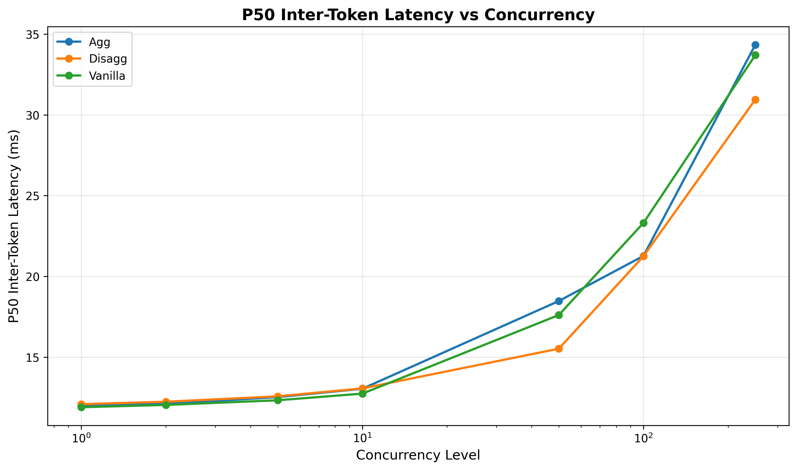
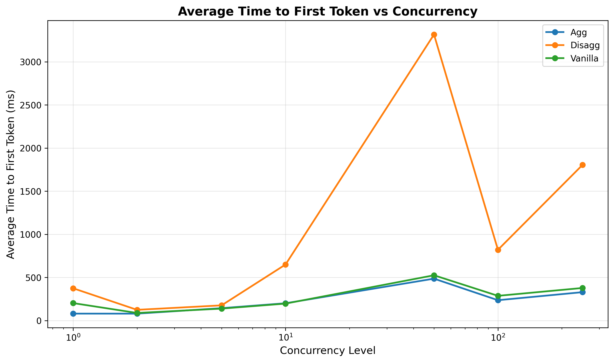
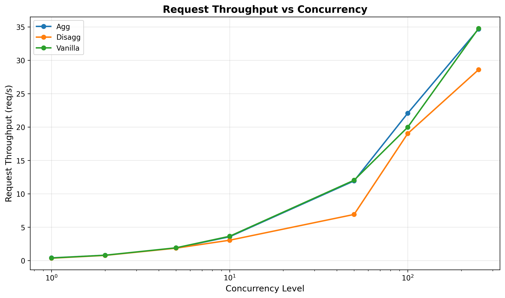
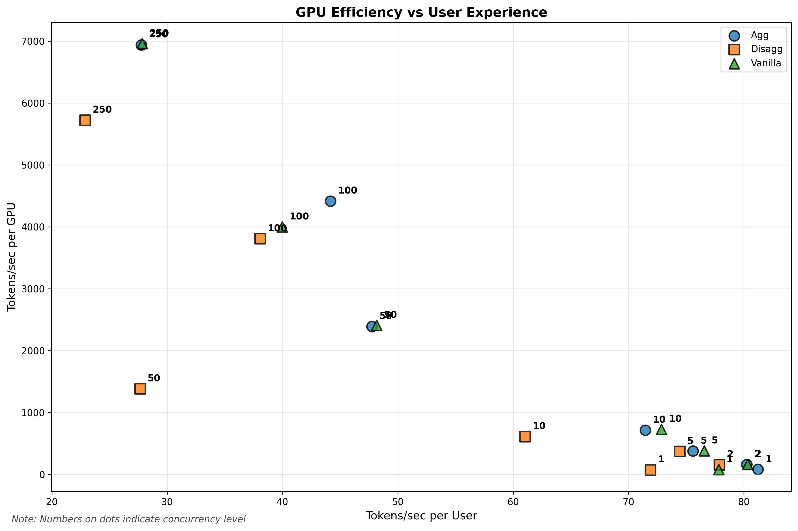
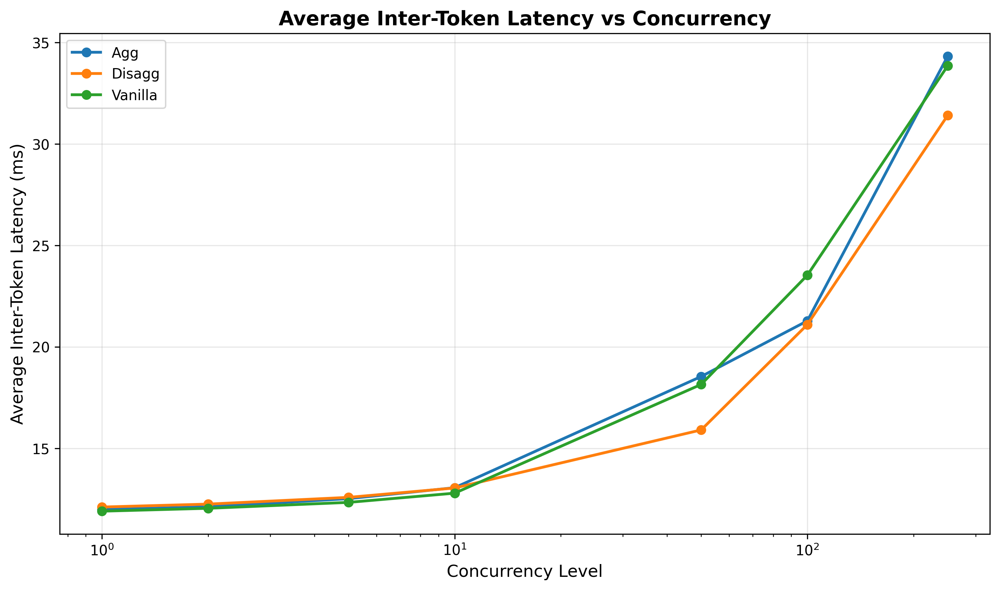

<!-- # SPDX-FileCopyrightText: Copyright (c) 2025 NVIDIA CORPORATION & AFFILIATES. All rights reserved.
# SPDX-License-Identifier: Apache-2.0
#
# Licensed under the Apache License, Version 2.0 (the "License");
# you may not use this file except in compliance with the License.
# You may obtain a copy of the License at
#
# http://www.apache.org/licenses/LICENSE-2.0
#
# Unless required by applicable law or agreed to in writing, software
# distributed under the License is distributed on an "AS IS" BASIS,
# WITHOUT WARRANTIES OR CONDITIONS OF ANY KIND, either express or implied.
# See the License for the specific language governing permissions and
# limitations under the License. -->

# Dynamo Benchmarking Guide

This guide shows how to benchmark NVIDIA Dynamo deployments on Kubernetes to compare performance between aggregated, disaggregated, and vanilla vLLM configurations.

## What You'll Get

Running the benchmark script will:
- Deploy and test three configurations: Dynamo aggregated, Dynamo disaggregated, and vanilla vLLM
- Generate performance plots comparing latency and throughput across different load levels
- Save all results to analyze optimal configurations for your workload

## Prerequisites

1. **Kubernetes namespace setup** - If coming from [deploy/utils/README](../../deploy/utils/README.md), you should have already completed this:
   ```bash
   # Should already be done if following deploy/utils setup
   NAMESPACE=benchmarking HF_TOKEN=$HF_TOKEN DOCKER_SERVER=$DOCKER_SERVER deploy/utils/setup_k8s_namespace.sh
   ```

2. **Tools** - All included in Dynamo containers:
   - kubectl
   - GenAI-Perf (NVIDIA's LLM benchmarking tool)
   - Python 3.8+
   - requirements under `deploy/utils/requirements.txt`

## Quick Start

### Important: Check Image Accessibility

Before running benchmarks, ensure the container images in your YAML manifests are accessible. The example manifests may contain private registry images that need to be updated.

Manually edit your manifests to use accessible images from [Dynamo NGC](https://catalog.ngc.nvidia.com/orgs/nvidia/teams/ai-dynamo/collections/ai-dynamo/artifacts) or your own registry with proper credentials configured.

You can also use the script below to automatically update the CRDs to use the public images.

```bash
# Update vLLM backend files
find components/backends/vllm/ -name "*.yaml" -type f -exec sed -i.bak 's|nvcr\.io/nvidian/[^[:space:]]*|nvcr.io/nvidia/ai-dynamo/vllm-runtime:0.4.0|g' {} \;
```

### Running the Benchmark

The easiest way to benchmark is using the automated script with example manifests. Modify the example manifests to use the model you would like to benchmark and to match your hardware. The default model is `meta-llama/Meta-Llama-3.1-8B-Instruct`.

```bash
# 1. Set your namespace (same one from deploy/utils setup)
export NAMESPACE=benchmarking

# 2. Run the benchmark script
./benchmarks/benchmark.sh \
   --namespace $NAMESPACE \
   --agg components/backends/vllm/deploy/agg.yaml \
   --disagg components/backends/vllm/deploy/disagg.yaml \
   --vanilla benchmarks/utils/templates/vanilla-vllm.yaml
```

You'll see output like this confirming your configuration:
```
=== Benchmark Configuration ===
Namespace:              benchmarking
Model:                  meta-llama/Meta-Llama-3.1-8B-Instruct
Input Sequence Length:  200 tokens      # Auto-configured default
Output Sequence Length: 200 tokens      # Auto-configured default
Sequence Std Dev:       10 tokens       # Auto-configured default
Output Directory:       ./benchmarks/results
Aggregated Config:      components/backends/vllm/deploy/agg.yaml
Disaggregated Config:   components/backends/vllm/deploy/disagg.yaml
Vanilla Config:         benchmarks/utils/templates/vanilla-vllm.yaml
===============================
```

The script will then:
1. Deploy each configuration (aggregated, disaggregated, vanilla vLLM)
2. Run GenAI-Perf benchmarks at various concurrency levels
3. Generate comparison plots in `./benchmarks/results/plots/`
4. Clean up deployments when complete

**Note**: The script auto-configures reasonable defaults for ISL/OSL (200 tokens each). You can override these with `--isl` and `--osl` flags if needed for your specific workload.

### What Happens During Benchmarking

The script automatically:
- Tests concurrency levels: 1, 2, 4, 8, 16, 32, 64, 128 concurrent requests
- Measures key metrics: latency, throughput, time-to-first-token
- Runs each test for sufficient duration to get stable results
- Handles all deployment lifecycle (create, wait, benchmark, cleanup)

### Using Your Own Models

To benchmark your specific model, customize the manifests:

```bash
# With custom manifests and parameters
./benchmarks/benchmark.sh \
   --namespace $NAMESPACE \
   --agg my-custom-agg.yaml \
   --disagg my-custom-disagg.yaml \
   --vanilla my-custom-vanilla.yaml \
   --model "meta-llama/Meta-Llama-3-8B" \
   --isl 512 \                    # input sequence length
   --osl 512 \                    # output sequence length
   --output-dir my_benchmark_results
```

**Important**: The model in your manifests must match what you're benchmarking. The `--model` flag is for GenAI-Perf configuration, not deployment.

### Direct Python Execution

For direct control over the benchmark workflow:

```bash
# Run benchmark directly with Python
python3 -u -m benchmarks.utils.benchmark \
   --agg $AGG_CONFIG \
   --disagg $DISAGG_CONFIG \
   --vanilla $VANILLA_VLLM_CONFIG \
   --isl 200 \
   --std 10 \
   --osl 200 \
   --namespace $NAMESPACE \
   --output-dir $OUTPUT_DIR

# Generate plots separately
python3 -m benchmarks.utils.plot --data-dir $OUTPUT_DIR
```

## Configuration Options

All configuration is done via command line arguments:

```bash
./benchmarks/benchmark.sh --namespace NAMESPACE --agg CONFIG --disagg CONFIG --vanilla CONFIG [OPTIONS]

REQUIRED:
  -n, --namespace NAMESPACE     Kubernetes namespace
  --agg CONFIG                  Aggregated deployment manifest
  --disagg CONFIG               Disaggregated deployment manifest
  --vanilla CONFIG              Vanilla vLLM deployment manifest

OPTIONS:
  -h, --help                    Show help message and examples
  -m, --model MODEL             Model name (default: deepseek-ai/DeepSeek-R1-Distill-Llama-8B)
  -i, --isl LENGTH              Input sequence length (default: 200)
  -s, --std STDDEV              Input sequence standard deviation (default: 10)
  -o, --osl LENGTH              Output sequence length (default: 200)
  -d, --output-dir DIR          Output directory (default: ./benchmarks/results)
  --verbose                     Enable verbose output
```

## Understanding Your Results

After benchmarking completes, check `./benchmarks/results/` (or your custom output directory):

### Summary and Plots

```
benchmarks/results/
├── SUMMARY.txt          # Quick overview of all results
└── plots/               # Visual comparisons (these are what you want!)
    ├── p50_inter_token_latency_vs_concurrency.png      # Token generation speed
    ├── avg_time_to_first_token_vs_concurrency.png      # Response time
    ├── request_throughput_vs_concurrency.png           # Requests per second
    ├── efficiency_tok_s_gpu_vs_user.png                # GPU efficiency
    └── avg_inter_token_latency_vs_concurrency.png      # Average latency
```

Example plots -- **for demonstration purposes only**:

<table>
  <tr>
    <td></td>
    <td></td>
    <td></td>
  </tr>
  <tr>
    <td></td>
    <td></td>
    <td></td>
  </tr>
</table>

### Data Files

For deeper analysis, raw data is organized by deployment type and concurrency:

```
benchmarks/results/
├── SUMMARY.txt                  # Human-readable benchmark summary
├── plots/                       # Performance visualization plots
│   ├── p50_inter_token_latency_vs_concurrency.png
│   ├── avg_inter_token_latency_vs_concurrency.png
│   ├── request_throughput_vs_concurrency.png
│   ├── efficiency_tok_s_gpu_vs_user.png
│   └── avg_time_to_first_token_vs_concurrency.png
├── agg/                         # Aggregated deployment results
│   ├── c1/                      # Concurrency level 1
│   │   └── profile_export_genai_perf.json
│   ├── c2/                      # Concurrency level 2
│   └── ...                      # Other concurrency levels
├── disagg/                      # Disaggregated deployment results
│   └── c*/                      # Same structure as agg/
└── vanilla/                     # Vanilla vLLM deployment results
    └── c*/                      # Same structure as agg/
```

Each concurrency directory contains:
- **`profile_export_genai_perf.json`** - Structured metrics from GenAI-Perf
- **`profile_export.json`** - Raw GenAI-Perf results
- **`inputs.json`** - Generated test inputs

## Advanced Usage

### Custom Concurrency Levels

Modify the benchmark script to test specific concurrency patterns:

```python
# Edit the CONCURRENCIES array in benchmarks/utils/genai.py
CONCURRENCIES=[1, 2, 5, 10, 50, 100, 250]
```

### Multi-Node Testing (TODO)

For multi-node Dynamo deployments:

1. Ensure your DGD configuration spans multiple nodes
2. Use appropriate tensor parallelism settings (`SCALE > 1`)
3. Monitor resource utilization across nodes

## Custom Benchmarking

### Bring Your Own Scripts

For custom benchmarking scenarios, you can:

1. **Create custom deployment manifests**: Configure your own agg, disagg, and vanilla manifests for your specific models and hardware configurations

2. **Modify concurrency levels**: Edit `benchmarks/utils/genai.py` to customize test parameters
   ```python
   CONCURRENCIES = [1, 5, 10, 25, 50, 100]  # Your custom levels
   ```

3. **Use direct Python modules**: Call the Python modules directly for full control
   ```bash
   # Custom benchmark workflow
   python3 -m benchmarks.utils.benchmark --help

   # Custom plot generation
   python3 -m benchmarks.utils.plot --help
   ```

4. **Extend the workflow**: Modify `benchmarks/utils/workflow.py` to add custom deployment types or metrics collection

5. **Generate different plots**: Modify `benchmarks/utils/plot.py` to generate a different set of plots for whatever you wish to visualize.

The `benchmark.sh` script provides a complete end-to-end benchmarking experience. For more granular control, use the Python modules directly.
