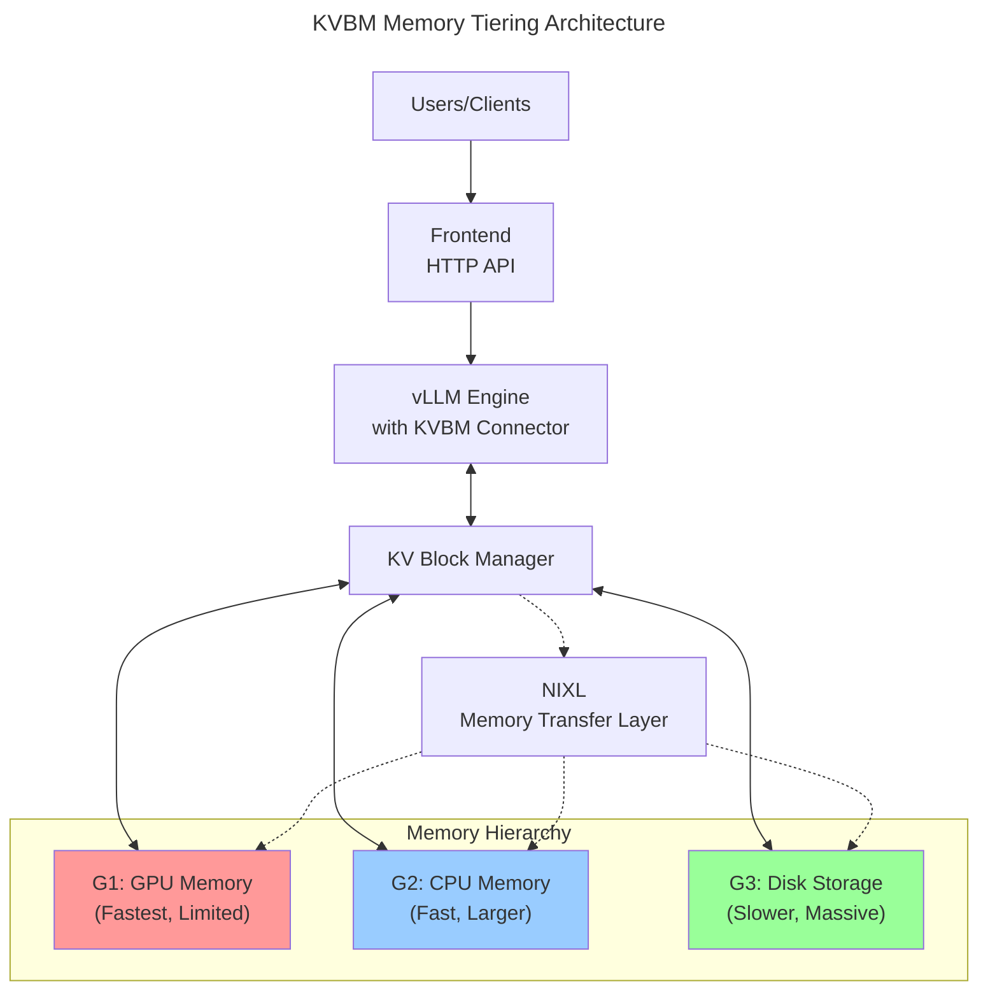

# KV Cache Offloading with KVBM

This example demonstrates Dynamo's **[KV Block Manager (KVBM)](../../../docs/architecture/kvbm_architecture.md)**, a sophisticated memory management system that enables efficient KV cache offloading across multiple memory tiers. KVBM allows vLLM to handle more concurrent requests and better utilize KV cache across multiple requests by intelligently managing completed KV blocks across GPU, CPU, and disk storage between inference requests.

## What is KVBM?

The KV Block Manager is a unified memory layer that extends vLLM's capacity beyond GPU memory limitations:

- **Multi-Tier Memory Management**: Seamlessly manages KV cache blocks across GPU HBM, CPU DRAM, and disk storage
- **Intelligent Offloading**: Automatically moves less frequently used blocks to slower tiers when GPU memory is constrained
- **Transparent Access**: Applications work identically whether blocks are in GPU, CPU, or disk storage
- **Dynamic Block Lifecycle**: Tracks block states and optimizes placement based on access patterns across multiple inference requests

> [!NOTE]
> For more details on the internal workings of KVBM, refer to the dedicated [KVBM Documentation](../../../docs/architecture/kvbm_intro.rst).

## Why Use KVBM?

Traditional LLM serving faces hard limits based on available GPU memory for storing KV cache across multiple requests. KVBM helps manage these constraints by offloading completed KV cache blocks between requests:

### Without KVBM

- KV cache limited to GPU memory (e.g., 80GB on H100)
- Must reject new requests when GPU KV cache is full
- Cannot efficiently reuse prefix caches when they get evicted from GPU
- Long-context requests consume GPU memory that affects subsequent requests

### With KVBM

- Leverage CPU/disk to store KV cache blocks from completed computations
- Handle 10x+ more concurrent requests by offloading inactive blocks
- Preserve prefix caches in CPU/disk for reuse across multiple requests
- Gracefully handle memory pressure by moving blocks between tiers rather than rejecting requests

## Architecture Overview



## Prerequisites

### 1. Infrastructure Services

Start etcd and NATS services required for KVBM coordination:

```bash
docker compose -f deploy/docker-compose.yml up -d
```

### 2. System Requirements

- **GPU**: Any NVIDIA GPU with sufficient memory for your model
- **CPU Memory**: At least 16GB RAM (more for larger offloading capacity)
- **Disk Space**: SSD recommended, at least 50GB free for disk offloading
- **Software**: Dynamo with vLLM support

```bash
pip install ai-dynamo[vllm]
```

## Quick Start

### Step 1: Basic KVBM with CPU Offloading

Start vLLM with KVBM enabled and 8GB CPU cache:

```bash
# Enable 8GB of CPU memory for KV cache offloading
export DYN_KVBM_CPU_CACHE_GB=8

# Start vLLM with KVBM connector
python -m dynamo.vllm \
    --model Qwen/Qwen3-0.6B \
    --connector kvbm \
    --gpu-memory-utilization 0.5
```

The `--gpu-memory-utilization 0.5` limits GPU usage to demonstrate offloading even with available GPU memory.

### Step 2: Launch Frontend

In another terminal:

```bash
python -m dynamo.frontend --http-port 8000
```

### Step 3: Test the API

Test with a sample request:

```bash
curl localhost:8000/v1/chat/completions \
  -H "Content-Type: application/json" \
  -d '{
    "model": "Qwen/Qwen3-0.6B",
    "messages": [
      {
        "role": "user",
        "content": "What are the benefits of KV cache offloading?"
      }
    ],
    "stream": false,
    "max_tokens": 100
  }'
```

## KVBM Configuration

### Multi-Tier Offloading (CPU + Disk)

Enable both CPU and disk tiers for maximum capacity:

```bash
# Configure memory tiers
export DYN_KVBM_CPU_CACHE_GB=16     # 16GB CPU cache
export DYN_KVBM_DISK_CACHE_GB=100   # 100GB disk cache

# Optional: Specify which disk/directory to use for offloading
# Note: To enable disk cache offloading, you must first enable CPU memory cache offloading.
export DYN_KVBM_DISK_CACHE_DIR=/path/to/fast/ssd  # Default: /tmp/

# Optional: Increase initialization timeout for large caches
export DYN_KVBM_LEADER_WORKER_INIT_TIMEOUT_SECS=600

# Start vLLM with full KVBM configuration
python -m dynamo.vllm \
    --model Qwen/Qwen3-0.6B \
    --connector kvbm
```

### Custom Block Sizes

For fine-grained control, specify exact block counts:

```bash
# Use specific block counts instead of GB
export DYN_KVBM_CPU_CACHE_OVERRIDE_NUM_BLOCKS=1000
export DYN_KVBM_DISK_CACHE_OVERRIDE_NUM_BLOCKS=5000

python -m dynamo.vllm \
    --model Qwen/Qwen3-0.6B \
    --connector kvbm \
    --block-size 16
```

## Monitoring KVBM Performance

### Check Memory Usage

Monitor how KVBM utilizes different memory tiers:

```bash
# Watch GPU memory usage
nvidia-smi -l 1

# Monitor system memory
watch -n 1 free -h

# Check disk I/O for disk tier activity
iostat -x 1
```

### Grafana Metrics Dashboard

For detailed metrics visualization, enable Prometheus and Grafana:

```bash
# Start services with metrics profile
docker compose -f deploy/docker-compose.yml --profile metrics up -d

# Start vLLM with metrics enabled
DYN_SYSTEM_ENABLED=true DYN_SYSTEM_PORT=6880 python -m dynamo.vllm \
    --model Qwen/Qwen3-0.6B \
    --connector kvbm

# Optional: Allow firewall access for metrics ports
sudo ufw allow 6880/tcp  # KVBM worker metrics
sudo ufw allow 6881/tcp  # KVBM leader metrics
```

Access the Grafana dashboard at `http://localhost:3001` (default login: dynamo/dynamo) and navigate to the KVBM Dashboard to view:

- KV offloading operations
- KV onboarding operations
- Memory tier utilization
- Block transfer rates
- Request latencies

### KVBM Logs

With [debug logging](../../../docs/guides/logging.md) enabled, you can observe KVBM operations:

```bash
export DYN_LOG=debug
python -m dynamo.vllm --model Qwen/Qwen3-0.6B --connector kvbm
```

Look for messages like:

```text
[DEBUG] Offloading block with sequence hash 1234567890 to target pool.
[DEBUG] Onboarding 3 blocks to target pool.
[WARN] Target pool full. Skipping offload. This should only ever happen with very small pool sizes.
[DEBUG] Adding blocks to pool
[DEBUG] Returning blocks to pool
```

## Prefix reuse speedup demo (KVBM vs baseline)

Demonstrate how KVBM preserves KV blocks between requests for better prefix cache reuse:

### What This Demo Shows

1. **Requests 1-4** arrive with different long prefixes → KV blocks computed and fill available GPU memory
2. **Request 5** arrives with a new prefix → GPU memory pressure triggers eviction:
   - **Baseline**: Evicts oldest prefix blocks entirely (lost forever)
   - **KVBM**: Offloads oldest prefix blocks to CPU (preserved via the 20GB CPU cache)
3. A later request needs a previously evicted prefix:
   - **Baseline**: Must recompute the entire 20K token prefix (slow)
   - **KVBM**: Fetches the preserved blocks from CPU back to GPU (faster)

### Setup

```bash
python -m dynamo.frontend --http-port 8000
```

Optional: Calculate GPU memory utilization automatically (useful for non-H100 GPUs). If unset, the examples below default to 0.2 which worked well on an H100:

```bash
# Option A: Fixed utilization known to work on H100
# GPU_UTIL=0.2

# Option B: Compute utilization clamped to [0.1, 0.4]
# Tune TARGET_MEMORY_GB to force some prefix eviction on your GPU
TARGET_MEMORY_GB=${TARGET_MEMORY_GB:-12}
GPU_MEMORY_GB=$(nvidia-smi --query-gpu=memory.total --format=csv,noheader,nounits | head -1 | awk '{print int($1/1024)}')
GPU_UTIL=$(echo "$TARGET_MEMORY_GB $GPU_MEMORY_GB" | awk '{util=$1/$2; if (util < 0.1) print 0.1; else if (util > 0.4) print 0.4; else printf "%.2f", util}')
echo "Using GPU utilization: ${GPU_UTIL} (TARGET_MEMORY_GB=${TARGET_MEMORY_GB}, GPU_MEMORY_GB=${GPU_MEMORY_GB})"
```

### Experiment 1: Baseline (no KVBM)

#### Start baseline server

```bash
# Run vLLM with NIXL (no KVBM)
CUDA_VISIBLE_DEVICES=0 python -m dynamo.vllm \
  --model Qwen/Qwen3-4B \
  --connector nixl \
  --gpu-memory-utilization ${GPU_UTIL:-0.2} \
  --enable-prefix-caching
```

Keep this process running while you benchmark in another terminal.

#### Run baseline benchmark

```bash
# Use genai-perf with prefix-specific flags to generate multiple different prefixes
# This creates memory pressure by cycling through different large prefixes

# For baseline (no offloading — prefixes get evicted and lost when GPU memory is full)
genai-perf profile \
  -m "Qwen/Qwen3-4B" \
  --endpoint-type chat --streaming \
  -u http://localhost:8000 \
  --synthetic-input-tokens-mean 128 \
  --synthetic-input-tokens-stddev 0 \
  --prefix-prompt-length 20000 \
  --num-prefix-prompts 5 \
  --output-tokens-mean 50 \
  --concurrency 1 \
  --request-count 30 \
  --tokenizer "Qwen/Qwen3-4B" \
  --artifact-dir ./benchmarks/results/baseline_prefix_test
```

Stop the baseline vLLM process (Ctrl+C) before starting the next experiment.

### Experiment 2: KVBM (20GB CPU cache)

#### Start KVBM server

```bash
export DYN_KVBM_CPU_CACHE_GB=20

CUDA_VISIBLE_DEVICES=0 python -m dynamo.vllm \
  --model Qwen/Qwen3-4B \
  --connector kvbm \
  --gpu-memory-utilization ${GPU_UTIL:-0.2} \
  --enable-prefix-caching
```

#### Run KVBM benchmark

```bash
genai-perf profile \
  -m "Qwen/Qwen3-4B" \
  --endpoint-type chat --streaming \
  -u http://localhost:8000 \
  --synthetic-input-tokens-mean 128 \
  --synthetic-input-tokens-stddev 0 \
  --prefix-prompt-length 20000 \
  --num-prefix-prompts 5 \
  --output-tokens-mean 50 \
  --concurrency 1 \
  --request-count 30 \
  --tokenizer "Qwen/Qwen3-4B" \
  --artifact-dir ./benchmarks/results/kvbm_prefix_test
```

### Expected Results

- **Baseline**: High TTFT variance as prefix blocks are repeatedly evicted and recomputed between requests
- **KVBM**: Lower and more consistent TTFT because prefix blocks are preserved in CPU memory between requests

## Benchmarking with LMBenchmark

[LMBenchmark](https://github.com/LMCache/LMBenchmark) provides synthetic multi-turn chat datasets for testing KVBM:

```bash
# Clone LMBenchmark
git clone https://github.com/LMCache/LMBenchmark.git
cd LMBenchmark/synthetic-multi-round-qa

# Run benchmark with long input, short output pattern
# Arguments: model, endpoint, output_prefix, qps
./long_input_short_output_run.sh \
    "Qwen/Qwen3-4B" \
    "http://localhost:8000" \
    "benchmark_kvbm" \
    1

# Results will show average TTFT and throughput metrics
```

Compare KVBM vs baseline by running the same benchmark with KVBM disabled:

```bash
# Baseline (no KVBM)
python -m dynamo.vllm --model Qwen/Qwen3-4B --connector nixl

# With KVBM
export DYN_KVBM_CPU_CACHE_GB=20
python -m dynamo.vllm --model Qwen/Qwen3-4B --connector kvbm
```

## Troubleshooting

### KVBM Not Initializing

If you see errors about KVBM initialization:

1. Verify etcd is running:

```bash
etcdctl endpoint health
```

1. Check environment variables:

```bash
env | grep DYN_KVBM
```

1. Ensure sufficient memory:

```bash
free -h  # Check available RAM
df -h    # Check disk space
```

### Performance Issues

If offloading causes slowdowns:

1. **Increase CPU cache size**: More CPU cache reduces disk access
2. **Use faster storage**: NVMe SSDs perform better than SATA
3. **Adjust block size**: Smaller blocks = more granular control
4. **Monitor swap**: Ensure system isn't swapping KVBM memory

### Disk Offloading Issues

Common disk-related problems and solutions:

1. **Permission Denied**:

   ```bash
   # Ensure write permissions for the cache directory
   sudo mkdir -p /mnt/nvme/kvbm_cache
   sudo chown $USER:$USER /mnt/nvme/kvbm_cache
   chmod 755 /mnt/nvme/kvbm_cache
   ```

2. **Disk Full Errors**:

   ```bash
   # Check available space
   df -h $DYN_KVBM_DISK_CACHE_DIR

   # Clean up old cache files if needed
   rm -f ${DYN_KVBM_DISK_CACHE_DIR}/dynamo-kvbm-disk-cache-*
   ```

3. **Slow Disk Performance**:

   ```bash
   # Test disk speed
   dd if=/dev/zero of=${DYN_KVBM_DISK_CACHE_DIR}/test bs=1G count=1 oflag=direct

   # Monitor disk I/O during operation
   iostat -x 1 | grep nvme
   ```

4. **Wrong Disk Being Used**:

   ```bash
   # Verify which directory is being used
   echo $DYN_KVBM_DISK_CACHE_DIR

   # Watch where files are created
   watch ls -lh ${DYN_KVBM_DISK_CACHE_DIR:-/tmp}/dynamo-kvbm-disk-cache-*
   ```

### Memory Calculation

To estimate memory requirements:

```text
GPU Memory = Model Size + (Active Blocks × Block Size)
CPU Memory = DYN_KVBM_CPU_CACHE_GB
Disk Space = DYN_KVBM_DISK_CACHE_GB

Total KV Capacity = GPU + CPU + Disk memory allocated for KV cache
```

## Cleanup

When finished with the example:

1. Stop all Dynamo components (Ctrl+C in each terminal)
1. Stop infrastructure services:

```bash
docker compose -f deploy/docker-compose.yml down
```

1. Clear any cached data if needed:

```bash
# KVBM cache is automatically cleaned on shutdown
# No manual cleanup required
```

## Next Steps

- **Production Deployment**: See the [Dynamo deploy guides](../../../docs/guides/dynamo_deploy/README.md) for production KVBM setups
- **Custom Policies**: Implement custom eviction policies for your workload
- **Monitoring**: Set up [metrics](../../../docs/guides/metrics.md) and [logging](../../../docs/guides/logging.md)
- **Optimization**: Profile your workload to tune tier sizes
- **Integration**: Combine KVBM with [KV-aware routing](../../../docs/architecture/kv_cache_routing.md) for maximum efficiency

## Further Reading

- [KVBM Architecture Documentation](../../../docs/architecture/kvbm_architecture.md)
- [KVBM Components Guide](../../../docs/architecture/kvbm_components.md)
- [NIXL Memory Transfer Layer](https://github.com/ai-dynamo/nixl/blob/main/docs/nixl.md)
