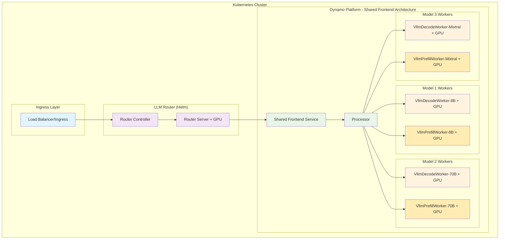
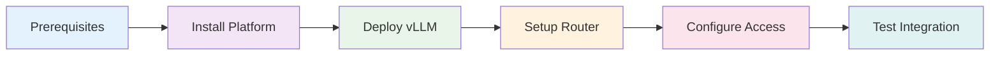

# LLM Router with NVIDIA Dynamo Cloud Platform
## Kubernetes Deployment Guide

<div align="center">

[](https://nvidia.com)
[](https://kubernetes.io)
[](https://docker.com)
[](https://helm.sh)

**Intelligent LLM Request Routing with Distributed Inference Serving**

</div>

---

This comprehensive guide provides step-by-step instructions for deploying the [**NVIDIA LLM Router**](https://github.com/NVIDIA-AI-Blueprints/llm-router) with the official [**NVIDIA Dynamo Cloud Platform**](https://docs.nvidia.com/dynamo/latest/guides/dynamo_deploy/dynamo_cloud.html) on Kubernetes.

## NVIDIA LLM Router and Dynamo Integration

### Overview

This integration combines two powerful NVIDIA technologies to create an intelligent, scalable LLM serving platform:

### NVIDIA Dynamo
- **Distributed inference serving framework**
- **Disaggregated serving capabilities**
- **Multi-model deployment support**
- **Kubernetes-native scaling**

### NVIDIA LLM Router
- **Intelligent request routing**
- **Task classification (12 categories)**
- **Complexity analysis (7 categories)**
- **Rust-based performance**

> **Result**: A complete solution for deploying multiple LLMs with automatic routing based on request characteristics, maximizing both **performance** and **cost efficiency**.

### Kubernetes Architecture Overview

<div align="center">



</div>

### Key Benefits

<div align="center">

| **Feature** | **Benefit** | **Impact** |
|:---:|:---:|:---:|
| **Intelligent Routing** | Auto-routes by task/complexity | **Optimal Model Selection** |
| **Cost Optimization** | Small models for simple tasks | **Reduced Infrastructure Costs** |
| **High Performance** | Rust-based minimal latency | **Sub-millisecond Routing** |
| **Scalability** | Disaggregated multi-model serving | **Enterprise-Grade Throughput** |
| **OpenAI Compatible** | Drop-in API replacement | **Zero Code Changes** |

</div>

### Integration Components

<details>
<summary><b>1. NVIDIA Dynamo Cloud Platform</b></summary>

- **Purpose**: Distributed LLM inference serving
- **Features**: Disaggregated serving, KV cache management, multi-model support
- **Deployment**: Kubernetes-native with custom resources
- **Models Supported**: Multiple LLMs (Llama, Mixtral, Phi, Nemotron, etc.)

</details>

<details>
<summary><b>2. NVIDIA LLM Router</b></summary>

- **Purpose**: Intelligent request routing and model selection
- **Features**: OpenAI API compliant, flexible policy system, configurable backends
- **Architecture**: Rust-based controller + Triton inference server
- **Routing Policies**: Task classification (12 categories), complexity analysis (7 categories)
- **Customization**: Fine-tune models for domain-specific routing (e.g., banking intent classification)

</details>

<details>
<summary><b>3. Integration Configuration</b></summary>

- **Router Policies**: Define routing rules for different task types
- **Model Mapping**: Map router decisions to Dynamo-served models
- **Service Discovery**: Kubernetes-native service communication
- **Security**: API key management via Kubernetes secrets

</details>

### Routing Strategies

<div align="center">

#### Task-Based Routing
*Routes requests based on the type of task being performed*

</div>

<details>
<summary><b>View Task Routing Table</b></summary>

| **Task Type** | **Target Model** | **Use Case** |
|:---|:---|:---|
| Code Generation | `llama-3.1-70b-instruct` | Programming tasks |
| Brainstorming | `llama-3.1-70b-instruct` | Creative ideation |
| Chatbot | `mixtral-8x22b-instruct-v0.1` | Conversational AI |
| Summarization | `llama-3.1-8b-instruct` | Text summarization |
| Open QA | `llama-3.1-70b-instruct` | Complex questions |
| Closed QA | `llama-3.1-8b-instruct` | Simple Q&A |
| Classification | `llama-3.1-8b-instruct` | Text classification |
| Extraction | `llama-3.1-8b-instruct` | Information extraction |
| Rewrite | `llama-3.1-8b-instruct` | Text rewriting |
| Text Generation | `mixtral-8x22b-instruct-v0.1` | General text generation |
| Other | `mixtral-8x22b-instruct-v0.1` | Miscellaneous tasks |
| Unknown | `llama-3.1-8b-instruct` | Unclassified tasks |

</details>

---

<div align="center">

#### Complexity-Based Routing
*Routes requests based on the complexity of the task*

</div>

<details>
<summary><b>View Complexity Routing Table</b></summary>

| **Complexity Level** | **Target Model** | **Use Case** |
|:---|:---|:---|
| Creativity | `llama-3.1-70b-instruct` | Creative tasks |
| Reasoning | `llama-3.1-70b-instruct` | Complex reasoning |
| Contextual-Knowledge | `llama-3.1-8b-instruct` | Context-dependent tasks |
| Few-Shot | `llama-3.1-70b-instruct` | Tasks with examples |
| Domain-Knowledge | `mixtral-8x22b-instruct-v0.1` | Specialized knowledge |
| No-Label-Reason | `llama-3.1-8b-instruct` | Unclassified complexity |
| Constraint | `llama-3.1-8b-instruct` | Tasks with constraints |

</details>

### Performance Benefits

<div align="center">

| **Metric** | **Improvement** | **How It Works** |
|:---:|:---:|:---|
| **Latency** | `↓ 40-60%` | Smaller models for simple tasks |
| **Cost** | `↓ 30-50%` | Large models only when needed |
| **Throughput** | `↑ 2-3x` | Better resource utilization |
| **Scalability** | `↑ 10x` | Independent component scaling |

</div>

### API Usage Examples

<div align="center">

#### Task-Based Routing

</div>

```bash
# Code generation task → Routes to meta-llama/Llama-3.1-70B-Instruct
curl -X POST http://llm-router.local/v1/chat/completions \
  -H "Content-Type: application/json" \
  -d '{
    "model": "",
    "messages": [{"role": "user", "content": "Write a Python function to sort a list"}],
    "max_tokens": 512,
    "nim-llm-router": {
      "policy": "task_router",
      "routing_strategy": "triton",
      "model": ""
    }
  }'
```

<div align="center">

#### Complexity-Based Routing

</div>

```bash
# Complex reasoning task → Routes to meta-llama/Llama-3.1-70B-Instruct
curl -X POST http://llm-router.local/v1/chat/completions \
  -H "Content-Type: application/json" \
  -d '{
    "model": "",
    "messages": [{"role": "user", "content": "Explain quantum entanglement"}],
    "max_tokens": 512,
    "nim-llm-router": {
      "policy": "complexity_router",
      "routing_strategy": "triton",
      "model": ""
    }
  }'
```

### How Dynamo Model Routing Works

The key insight is that Dynamo provides a **single gateway endpoint** that routes to different models based on the `model` parameter in the OpenAI-compatible API request:

1. **Single Endpoint**: `http://vllm-frontend-frontend.dynamo-kubernetes.svc.cluster.local:8000/v1`
2. **Model-Based Routing**: Dynamo routes internally based on the `model` field in requests
3. **OpenAI Compatibility**: Standard OpenAI API format with model selection

Example request:
```json
{
  "model": "llama-3.1-70b-instruct",  // Dynamo routes based on this
  "messages": [...],
  "temperature": 0.7
}
```

Dynamo's internal architecture handles:
- Model registry and discovery
- Request parsing and routing
- Load balancing across replicas
- KV cache management
- Disaggregated serving coordination

## Kubernetes Integration Deployment

This integration demonstrates how to deploy the official NVIDIA Dynamo Cloud Platform for distributed LLM inference on Kubernetes and route requests intelligently using the NVIDIA LLM Router. The Kubernetes deployment includes:

1. **NVIDIA Dynamo Cloud Platform**: Distributed inference serving with Kubernetes operators and custom resources
2. **LLM Router**: Helm-deployed intelligent request routing with GPU-accelerated routing models
3. **Multiple LLM Models**: Containerized models deployed via DynamoGraphDeployment CRs


### Key Components

#### Shared Frontend Architecture

The deployment now uses a **shared frontend architecture** that splits the original `agg.yaml` into separate components for better resource utilization and model sharing:

- **frontend.yaml**: Shared OpenAI-compatible API frontend service
  - Single frontend instance serves all models
  - Handles request routing and load balancing
  - Reduces resource overhead compared to per-model frontends
  - Uses official NGC Dynamo vLLM Runtime container from `DYNAMO_IMAGE` variable

- **agg.yaml / disagg.yaml**: Templates for model-specific workers
  - **agg.yaml**: Aggregated worker configuration with VllmDecodeWorker (1 GPU per model)
  - **disagg.yaml**: Disaggregated worker configuration with separate VllmDecodeWorker and VllmPrefillWorker (1 GPU each)
  - Common: Shared configuration (model, block-size, KV connector)
  - Deployed per model with unique names using environment variables

#### Configuration Files

- **router-config-dynamo.yaml**: Router policies for Dynamo integration (uses `${DYNAMO_API_BASE}` variable)
- **llm-router-values-override.yaml**: Helm values for LLM Router with Dynamo integration (defines `dynamo.api_base` variable)

### Shared Frontend Benefits

<div align="center">

| **Benefit** | **Shared Frontend** | **Per-Model Frontend** | **Improvement** |
|:---:|:---:|:---:|:---:|
| **Resource Usage** | 1 Frontend + N Workers | N Frontends + N Workers | **↓ 30-50% CPU/Memory** |
| **Network Complexity** | Single Endpoint | Multiple Endpoints | **Simplified Routing** |
| **Maintenance** | Single Service | Multiple Services | **↓ 70% Ops Overhead** |
| **Load Balancing** | Built-in across models | Per-model only | **Better Utilization** |
| **API Consistency** | Single OpenAI API | Multiple APIs | **Unified Interface** |

</div>

**Key Advantages:**
- **Resource Efficiency**: Single frontend serves all models, reducing CPU and memory overhead
- **Simplified Operations**: One service to monitor, scale, and maintain instead of multiple frontends  
- **Better Load Distribution**: Intelligent request routing across all available model workers
- **Cost Optimization**: Fewer running services means lower infrastructure costs
- **Unified API Gateway**: Single endpoint for all models with consistent OpenAI API interface

### Disaggregated Serving Configuration

The deployment uses the official disaggregated serving architecture based on [Dynamo's vLLM backend deployment reference](https://github.com/ai-dynamo/dynamo/tree/main/components/backends/vllm/deploy):

**Key Features**:
- **Multi-Model Support**: Deploy multiple models (Llama-3.1-8B, Llama-3.1-70B, Mixtral-8x22B) using environment variables
- **KV Transfer**: Uses `DynamoNixlConnector` for high-performance KV cache transfer
- **Conditional Disaggregation**: Automatically switches between prefill and decode workers
- **Remote Prefill**: Offloads prefill operations to dedicated VllmPrefillWorker instances
- **Prefix Caching**: Enables intelligent caching for improved performance
- **Block Size**: 64 tokens for optimal memory utilization
- **Max Model Length**: 16,384+ tokens context window (varies by model)
- **Shared Frontend**: Single frontend serves all deployed models
- **Intelligent Routing**: LLM Router selects optimal model based on task complexity


### Environment Variables

Set the required environment variables for deployment:

| Variable | Description | Example | Required | Used In |
|----------|-------------|---------|----------|---------|
| `NAMESPACE` | Kubernetes namespace for deployment | `dynamo-kubernetes` | Yes | All deployments |
| `DYNAMO_VERSION` | Dynamo vLLM runtime version | `0.4.1` | Yes | Platform install |
| `MODEL_NAME` | Hugging Face model to deploy | `meta-llama/Llama-3.1-8B-Instruct` | Yes | Model deployment |
| `MODEL_SUFFIX` | Kubernetes deployment name suffix | `llama-8b` | Yes | Model deployment |
| `DYNAMO_IMAGE` | Full Dynamo runtime image path | `nvcr.io/nvidia/ai-dynamo/vllm-runtime:0.4.1` | Yes | Model deployment |
| `HF_TOKEN` | Hugging Face access token | `your_hf_token` | Yes | Model access |
| `NGC_API_KEY` | NVIDIA NGC API key | `your-ngc-api-key` | No | Private images |
| `DYNAMO_API_BASE` | Dynamo service endpoint URL | `http://vllm-frontend-frontend.dynamo-kubernetes.svc.cluster.local:8000` | Yes | LLM Router |
| `DYNAMO_API_KEY` | Dynamo API authentication key | `""` (empty) | Yes* | LLM Router auth |

*Required for router configuration but can be empty for local deployments

### Model Size Recommendations

For optimal deployment experience, consider model size vs. resources:

| Model Size | GPU Memory | Download Time | Recommended For |
|------------|------------|---------------|-----------------|
| **Small (1-2B)** | ~3-4GB | 2-5 minutes | Development, testing |
| **Medium (7-8B)** | ~8-12GB | 10-20 minutes | Production, single GPU |
| **Large (70B+)** | ~40GB+ | 30+ minutes | Multi-GPU setups |

**Recommended Models:**
- `meta-llama/Llama-3.1-8B-Instruct` - Balanced performance, used in router config (15GB)
- `meta-llama/Llama-3.1-70B-Instruct` - High performance, used in router config (40GB+)
- `mistralai/Mixtral-8x22B-Instruct-v0.1` - Creative tasks, used in router config (90GB+)
- `Qwen/Qwen2.5-1.5B-Instruct` - Fast testing model (3GB)
- `TinyLlama/TinyLlama-1.1B-Chat-v1.0` - Ultra-fast testing (2GB)

> **💡 Health Check Configuration**: The `frontend.yaml` and `disagg.yaml` include extended health check timeouts (30 minutes) to allow sufficient time for model download and loading. Health checks must be configured at the service level, not in `extraPodSpec`, for the Dynamo operator to respect them. The shared frontend architecture reduces the number of health checks needed compared to per-model frontends.

**NGC Setup Instructions**:
1. **Choose Dynamo Version**: Visit [NGC Dynamo vLLM Runtime Tags](https://catalog.ngc.nvidia.com/orgs/nvidia/teams/ai-dynamo/containers/vllm-runtime/tags) to see available versions
2. **Set Version**: Export your chosen version: `export DYNAMO_VERSION=0.4.1` (or latest available)
3. **Optional - NGC API Key**: Visit [https://ngc.nvidia.com/setup/api-key](https://ngc.nvidia.com/setup/api-key) if you need private image access
4. **Prebuilt Images**: NGC provides prebuilt CUDA and ML framework images, eliminating the need for local builds

**Available NGC Dynamo Images**:
- **vLLM Runtime**: `nvcr.io/nvidia/ai-dynamo/vllm-runtime:0.4.1` (recommended)
- **SGLang Runtime**: `nvcr.io/nvidia/ai-dynamo/sglang-runtime:0.4.1`
- **TensorRT-LLM Runtime**: `nvcr.io/nvidia/ai-dynamo/tensorrtllm-runtime:0.4.1`
- **Dynamo Kubernetes Operator**: `nvcr.io/nvidia/ai-dynamo/dynamo-operator:latest`
- **Dynamo Deployment API**: `nvcr.io/nvidia/ai-dynamo/dynamo-api-store:latest`

### Resource Requirements

**Kubernetes Production Deployment**:

**Minimum Requirements**:
- **Kubernetes cluster** with 4+ GPU nodes for disaggregated serving
- **Each node**: 16+ CPU cores, 64GB+ RAM, 2-4 GPUs
- **Storage**: 500GB+ for model storage (SSD recommended)
- **Network**: High-bandwidth interconnect for multi-node setups

**Component Resource Allocation**:
- **Frontend**: 1-2 CPU cores, 2-4GB RAM (handles HTTP requests)
- **Processor**: 2-4 CPU cores, 4-8GB RAM (request processing)
- **VllmDecodeWorker**: 4+ GPU, 8+ CPU cores, 16GB+ RAM (model inference)
- **VllmPrefillWorker**: 2+ GPU, 4+ CPU cores, 8GB+ RAM (prefill operations)
- **Router**: 1-2 CPU cores, 2-4GB RAM (KV-aware routing)
- **LLM Router**: 1 GPU, 2 CPU cores, 4GB RAM (routing model inference)

**Scaling Considerations**:
- **Disaggregated Serving**: Separate prefill and decode for better throughput
- **Horizontal Scaling**: Multiple VllmDecodeWorker and VllmPrefillWorker replicas
- **GPU Memory**: Adjust based on model size (70B models need 40GB+ VRAM per GPU)

## Prerequisites

<div align="center">

[](https://github.com/ai-dynamo/dynamo/blob/main/docs/guides/dynamo_deploy/dynamo_cloud.md#prerequisites)

*Ensure your environment meets all requirements before deployment*

</div>

### Required Tools

<div align="center">

**Verify you have the required tools installed:**

</div>

```bash
# Required tools verification
kubectl version --client
helm version
docker version
```

<div align="center">

| **Tool** | **Requirement** | **Status** |
|:---:|:---:|:---:|
| **kubectl** | `v1.24+` | Check with `kubectl version --client` |
| **Helm** | `v3.0+` | Check with `helm version` |
| **Docker** | Running daemon | Check with `docker version` |

</div>

**Additional Requirements:**
- **NVIDIA GPU nodes** with GPU Operator installed (for LLM inference)
- **Container registry access** (Docker Hub, NVIDIA NGC, etc.)
- **Git** for cloning repositories

### Inference Runtime Images

Set your inference runtime image from the available NGC options:

```bash
# Set your inference runtime image
export DYNAMO_IMAGE=nvcr.io/nvidia/ai-dynamo/vllm-runtime:0.4.1
```

**Available Runtime Images**:
- `nvcr.io/nvidia/ai-dynamo/vllm-runtime:0.4.1` - vLLM backend (recommended)
- `nvcr.io/nvidia/ai-dynamo/sglang-runtime:0.4.1` - SGLang backend
- `nvcr.io/nvidia/ai-dynamo/tensorrtllm-runtime:0.4.1` - TensorRT-LLM backend

### Hugging Face Token

For accessing models from Hugging Face Hub, you'll need a Hugging Face token:

```bash
# Set your Hugging Face token for model access
export HF_TOKEN=your_hf_token
```

Get your token from [https://huggingface.co/settings/tokens](https://huggingface.co/settings/tokens)

### Kubernetes Cluster Requirements

#### PVC Support with Default Storage Class
Dynamo Cloud requires Persistent Volume Claim (PVC) support with a default storage class. Verify your cluster configuration:

```bash
# Check if default storage class exists
kubectl get storageclass

# Expected output should show at least one storage class marked as (default)
# Example:
# NAME                 PROVISIONER             RECLAIMPOLICY   VOLUMEBINDINGMODE      ALLOWVOLUMEEXPANSION   AGE
# standard (default)   kubernetes.io/gce-pd    Delete          Immediate              true                   1d
```

### Optional Requirements

#### Service Mesh (Optional)
For advanced networking and security features, you may want to install:
- **Istio service mesh**: For advanced traffic management and security

```bash
# Check if Istio is installed
kubectl get pods -n istio-system

# Expected output should show running Istio pods
# istiod-* pods should be in Running state
```

If Istio is not installed, follow the [official Istio installation guide](https://istio.io/latest/docs/setup/getting-started/).

## Pre-Deployment Validation

<div align="center">

[](https://kubernetes.io)

*Validate your environment before starting deployment*

</div>

Before starting the deployment, validate that your environment meets all requirements:

### Validate Kubernetes Cluster

```bash
# Verify Kubernetes cluster access and version
kubectl version --client
kubectl cluster-info

# Check node resources and GPU availability
kubectl get nodes -o wide
kubectl describe nodes | grep -A 5 "Capacity:"

# Verify default storage class exists
kubectl get storageclass
```

### Validate Container Registry Access

```bash
# Test NGC registry access (if using NGC images)
docker login nvcr.io --username '$oauthtoken' --password $NGC_API_KEY

# Verify you can pull the Dynamo runtime image
docker pull $DYNAMO_IMAGE
```

### Validate Configuration Files

```bash
# Navigate to the deployment directory
cd examples/deployments/LLM\ Router

# Check that required files exist
ls -la frontend.yaml agg.yaml disagg.yaml router-config-dynamo.yaml llm-router-values-override.yaml

# Validate YAML syntax
python -c "import yaml; yaml.safe_load(open('frontend.yaml'))" && echo "frontend.yaml is valid"
python -c "import yaml; yaml.safe_load(open('agg.yaml'))" && echo "agg.yaml is valid"
python -c "import yaml; yaml.safe_load(open('disagg.yaml'))" && echo "disagg.yaml is valid"
python -c "import yaml; yaml.safe_load(open('router-config-dynamo.yaml'))" && echo "router-config-dynamo.yaml is valid"
python -c "import yaml; yaml.safe_load(open('llm-router-values-override.yaml'))" && echo "llm-router-values-override.yaml is valid"
```

### Environment Setup

```bash
# Core deployment variables
export NAMESPACE=dynamo-kubernetes
export DYNAMO_VERSION=0.4.1  # Choose your Dynamo version from NGC catalog
export DYNAMO_IMAGE=nvcr.io/nvidia/ai-dynamo/vllm-runtime:${DYNAMO_VERSION}

# Model deployment variables (deploy all three models)
export MODEL_NAME=meta-llama/Llama-3.1-8B-Instruct  # Start with this model
export MODEL_SUFFIX=llama-8b  # Kubernetes-compatible deployment suffix
export HF_TOKEN=your_hf_token

# Deploy other models by changing MODEL_NAME and MODEL_SUFFIX:
# export MODEL_NAME=meta-llama/Llama-3.1-70B-Instruct
# export MODEL_SUFFIX=llama-70b
# export MODEL_NAME=mistralai/Mixtral-8x22B-Instruct-v0.1
# export MODEL_SUFFIX=mixtral-8x22b

# Optional variables
export NGC_API_KEY=your-ngc-api-key  # Optional for public images

# LLM Router variables (set during router deployment)
export DYNAMO_API_BASE="http://vllm-frontend-frontend.${NAMESPACE}.svc.cluster.local:8000"
export DYNAMO_API_KEY=""  # Empty for local deployments (no authentication required)
```

### Validate Environment Variables

```bash
# Check required environment variables are set
echo "NAMESPACE: ${NAMESPACE:-'NOT SET'}"
echo "DYNAMO_VERSION: ${DYNAMO_VERSION:-'NOT SET'}"
echo "MODEL_NAME: ${MODEL_NAME:-'NOT SET'}"
echo "DYNAMO_IMAGE: ${DYNAMO_IMAGE:-'NOT SET'}"
echo "HF_TOKEN: ${HF_TOKEN:-'NOT SET'}"
echo "NGC_API_KEY: ${NGC_API_KEY:-'NOT SET (optional for public images)'}"
echo "DYNAMO_API_BASE: ${DYNAMO_API_BASE:-'NOT SET (set during router deployment)'}"
echo "DYNAMO_API_KEY: ${DYNAMO_API_KEY:-'NOT SET (can be empty for local deployments)'}"
```

## Deployment Guide

<div align="center">

[](https://kubernetes.io)

**Complete walkthrough for deploying NVIDIA Dynamo and LLM Router**

</div>

---


### Deployment Overview

<div align="center">



</div>

### Step 1: Install Dynamo Platform (Path A: Production Install)

<div align="center">

[](https://github.com/ai-dynamo/dynamo/blob/main/docs/guides/dynamo_deploy/dynamo_cloud.md#path-a-production-install)

*Deploy the Dynamo Cloud Platform using the official **Path A: Production Install***

</div>


```bash
# 1. Install CRDs (use 'upgrade' instead of 'install' if already installed)
helm fetch https://helm.ngc.nvidia.com/nvidia/ai-dynamo/charts/dynamo-crds-${DYNAMO_VERSION}.tgz
helm install dynamo-crds dynamo-crds-${DYNAMO_VERSION}.tgz --namespace default

# 2. Install Platform (use 'upgrade' instead of 'install' if already installed)
kubectl create namespace ${NAMESPACE}
helm fetch https://helm.ngc.nvidia.com/nvidia/ai-dynamo/charts/dynamo-platform-${DYNAMO_VERSION}.tgz
helm install dynamo-platform dynamo-platform-${DYNAMO_VERSION}.tgz --namespace ${NAMESPACE}

# 3. Verify deployment
# Check CRDs
kubectl get crd | grep dynamo
# Check operator and platform pods
kubectl get pods -n ${NAMESPACE}
# Expected: dynamo-operator-* and etcd-* pods Running
kubectl get svc -n ${NAMESPACE}
```

### Step 2: Deploy Multiple vLLM Models

<div align="center">

[](https://github.com/ai-dynamo/dynamo/blob/main/components/backends/vllm/deploy/README.md)

*Deploy multiple vLLM models for intelligent routing*

</div>


Since our LLM Router routes to different models based on task complexity, we can deploy models using the environment variables already set in Step 1. Following the official [vLLM backend deployment guide](https://github.com/ai-dynamo/dynamo/blob/main/components/backends/vllm/deploy/README.md#3-deploy):

```bash
# 1. Create Kubernetes secret for Hugging Face token (using variables from Step 1)
kubectl create secret generic hf-token-secret \
  --from-literal=HF_TOKEN=${HF_TOKEN} \
  -n ${NAMESPACE}

# 2. Navigate to your LLM Router directory (where agg.yaml/disagg.yaml are located)
cd "examples/deployments/LLM Router/"
```

#### Shared Frontend Deployment

**Step 1: Deploy Shared Frontend**
```bash
# Deploy the shared frontend service (serves all models)
envsubst < frontend.yaml | kubectl apply -f - -n ${NAMESPACE}
```

**Step 2: Deploy Model Workers**

Choose your worker deployment approach:

**Deploy Model 1 (Llama 8B - Simple Tasks):**
```bash
# Deploy Llama 8B model for simple tasks
export MODEL_NAME=meta-llama/Llama-3.1-8B-Instruct
export MODEL_SUFFIX=llama-8b
envsubst < agg.yaml | kubectl apply -f - -n ${NAMESPACE}
```

**Deploy Model 2 (Llama 70B - Complex Tasks):**
```bash
# Deploy Llama 70B model for complex tasks
export MODEL_NAME=meta-llama/Llama-3.1-70B-Instruct
export MODEL_SUFFIX=llama-70b
envsubst < disagg.yaml | kubectl apply -f - -n ${NAMESPACE}
```

**Deploy Model 3 (Mixtral - Creative Tasks):**
```bash
# Deploy Mixtral model for creative/conversational tasks
export MODEL_NAME=mistralai/Mixtral-8x22B-Instruct-v0.1
export MODEL_SUFFIX=mixtral-8x22b
envsubst < disagg.yaml | kubectl apply -f - -n ${NAMESPACE}
```

### Adding More Models (Optional)

**Current Setup**: We deploy 3 models that cover most use cases:
- **Llama-3.1-8B**: Fast model for simple tasks
- **Llama-3.1-70B**: Powerful model for complex tasks  
- **Mixtral-8x22B**: Creative model for conversational tasks

**To add more models**, follow this pattern:

#### Example: Adding Phi-3-Mini Model

```bash
# Simply set the model name and suffix, then deploy using existing files
export MODEL_NAME=microsoft/Phi-3-mini-128k-instruct
export MODEL_SUFFIX=phi-3-mini

# Deploy using aggregated workers
envsubst < agg.yaml | kubectl apply -f - -n ${NAMESPACE}

# OR deploy using disaggregated workers  
envsubst < disagg.yaml | kubectl apply -f - -n ${NAMESPACE}
```

**Repeat this pattern** for any additional models you want to deploy.

### Step 3: Verify Shared Frontend Deployment

<div align="center">

[](https://kubernetes.io)

*Verify that the shared frontend and model workers have been deployed successfully*

</div>

```bash
# Check deployment status for shared frontend and all model workers
kubectl get pods -n ${NAMESPACE}
kubectl get svc -n ${NAMESPACE}

# Verify shared frontend is running
kubectl logs deployment/frontend -n ${NAMESPACE} --tail=10

# Look for all model worker pods
kubectl get pods -n ${NAMESPACE} | grep -E "(worker|decode|prefill)"

# Verify the shared frontend service (single port for all models)
kubectl get svc -n ${NAMESPACE} | grep frontend
```

### Step 4: Test Shared Frontend Service

<div align="center">

[](https://checkmarx.com)

*Test the shared frontend service with different models*

</div>

```bash
# Forward the shared frontend service port
kubectl port-forward svc/vllm-frontend-frontend 8000:8000 -n ${NAMESPACE} &

# Test different models through the same endpoint by specifying the model name

# Test Model 1 (e.g., Llama-3.1-8B)
curl localhost:8000/v1/chat/completions \
  -H "Content-Type: application/json" \
  -d '{
    "model": "meta-llama/Llama-3.1-8B-Instruct",
    "messages": [{"role": "user", "content": "Simple question: What is 2+2?"}],
    "stream": false,
    "max_tokens": 30
  }' | jq

# Test Model 2 (e.g., Llama-3.1-70B if deployed)
curl localhost:8000/v1/chat/completions \
  -H "Content-Type: application/json" \
  -d '{
    "model": "meta-llama/Llama-3.1-70B-Instruct",
    "messages": [{"role": "user", "content": "Explain quantum computing briefly"}],
    "stream": false,
    "max_tokens": 100
  }' | jq

# Check health and available models
curl localhost:8000/health
curl localhost:8000/v1/models | jq
```

### Step 5: Set Up LLM Router API Keys

<div align="center">

[](https://github.com/NVIDIA-AI-Blueprints/llm-router)

*Configure API keys for LLM Router integration*

</div>

**IMPORTANT**: The router configuration uses Kubernetes secrets for API key management following the [official NVIDIA pattern](https://github.com/NVIDIA-AI-Blueprints/llm-router/blob/main/deploy/helm/llm-router/templates/router-controller-configmap.yaml).

```bash
# 1. Create the LLM Router namespace
kubectl create namespace llm-router

# 2. Create secret for Dynamo API key (empty for local deployments)
# Note: For local Dynamo deployments, API keys are not required
kubectl create secret generic dynamo-api-secret \
  --from-literal=DYNAMO_API_KEY="" \
  --namespace=llm-router

# 3. (Optional) Create image pull secret for private registries (only if using private container registry)
kubectl create secret docker-registry nvcr-secret \
  --docker-server=nvcr.io \
  --docker-username='$oauthtoken' \
  --docker-password="your-ngc-api-key-here" \
  --namespace=llm-router

# 4. Verify secrets were created
kubectl get secrets -n llm-router
```

### Step 6: Deploy LLM Router

<div align="center">

[](https://github.com/NVIDIA-AI-Blueprints/llm-router)

*Deploy the NVIDIA LLM Router using Helm*

</div>

**Note**: The NVIDIA LLM Router requires building images from source and using the official Helm charts from the GitHub repository.

```bash
# 1. Clone the NVIDIA LLM Router repository (required for Helm charts)
git clone https://github.com/NVIDIA-AI-Blueprints/llm-router.git
cd llm-router

# 2. Configure Docker Registry (REQUIRED)
# IMPORTANT: Update the imageRegistry in llm-router-values-override.yaml before deployment
# The file contains a placeholder "YOUR_REGISTRY_HERE/" that MUST be replaced.

# Edit the values file:
nano ../examples/deployments/LLM\ Router/llm-router-values-override.yaml

# Update line ~34: Replace "YOUR_REGISTRY_HERE/" with your actual registry:
# Examples:
# - "nvcr.io/nvidia/" (if you have access to NVIDIA's public registry)
# - "your-company-registry.com/llm-router/" (for private registries)  
# - "docker.io/your-username/" (for Docker Hub)

# Also update imagePullSecrets name to match your registry credentials

# If you need to build custom images, use:
# docker build -t <your-registry>/router-server:latest -f src/router-server/router-server.dockerfile .
# docker build -t <your-registry>/router-controller:latest -f src/router-controller/router-controller.dockerfile .
# docker push <your-registry>/router-server:latest
# docker push <your-registry>/router-controller:latest


# 3. Create router configuration ConfigMap using official External ConfigMap strategy
# The official Helm chart now supports external ConfigMaps natively
kubectl create configmap router-config-dynamo \
  --from-file=config.yaml=../examples/deployments/LLM\ Router/router-config-dynamo.yaml \
  --namespace=llm-router

# 4. Prepare router models (download from NGC)
# Download the NemoCurator Prompt Task and Complexity Classifier model from NGC:
# https://catalog.ngc.nvidia.com/orgs/nvidia/teams/nemo/models/prompt-task-and-complexity-classifier/version
# Follow the main project README to download models to local 'routers/' directory
# Then create PVC and upload models:

kubectl apply -f - <<EOF
apiVersion: v1
kind: PersistentVolumeClaim
metadata:
  name: router-models-pvc
  namespace: llm-router
spec:
  accessModes: ["ReadWriteOnce"]
  resources:
    requests:
      storage: 100Gi
EOF

# Create temporary pod to upload models
kubectl apply -f - <<EOF
apiVersion: v1
kind: Pod
metadata:
  name: model-uploader
  namespace: llm-router
spec:
  containers:
  - name: uploader
    image: alpine
    command: ["sleep", "3600"]
    volumeMounts:
    - name: models
      mountPath: /models
  volumes:
  - name: models
    persistentVolumeClaim:
      claimName: router-models-pvc
EOF

# Wait and copy models
kubectl wait --for=condition=ready pod/model-uploader -n llm-router --timeout=60s
kubectl cp routers/ llm-router/model-uploader:/models/
kubectl delete pod model-uploader -n llm-router

# 4. Create placeholder API key secret (required by router controller)
kubectl create secret generic llm-api-keys \
  --from-literal=nvidia_api_key="" \
  --namespace=llm-router \
  --dry-run=client -o yaml | kubectl apply -f -

# 5. Deploy LLM Router using official External ConfigMap strategy
cd deploy/helm/llm-router
helm upgrade --install llm-router . \
  --namespace llm-router \
  --values ../../../../examples/deployments/LLM\ Router/llm-router-values-override.yaml \
  --wait --timeout=10m

# 6. Verify LLM Router deployment
kubectl get pods -n llm-router
kubectl get svc -n llm-router

# Wait for all pods to be ready
kubectl wait --for=condition=ready pod -l app.kubernetes.io/name=llm-router -n llm-router --timeout=300s
```

### Step 7: Configure External Access

<div align="center">

[](https://kubernetes.io)

*Configure external access to the LLM Router*

</div>

```bash
# For development/testing, use port forwarding to access LLM Router
kubectl port-forward svc/llm-router-router-controller 8084:8084 -n llm-router

# Test the LLM Router API
curl http://localhost:8084/health
```

## Configuration

### Ingress Configuration

The LLM Router is configured with ingress disabled by default to avoid service name conflicts. To enable external access:

```yaml
ingress:
  enabled: false  # Disabled by default - enable after deployment is working
  className: "nginx"  # Adjust for your ingress controller
  hosts:
    - host: llm-router.local  # Change to your domain
      paths:
        - path: /
          pathType: Prefix
```

**Important**: Update the `host` field in `llm-router-values-override.yaml` to match your domain:

```bash
# For production, replace llm-router.local with your actual domain
sed -i 's/llm-router.local/your-domain.com/g' llm-router-values-override.yaml
```

**For local testing**, add the ingress IP to your `/etc/hosts`:

```bash
# Get the ingress IP and add to hosts file
INGRESS_IP=$(kubectl get ingress llm-router -n llm-router -o jsonpath='{.status.loadBalancer.ingress[0].ip}')
echo "$INGRESS_IP llm-router.local" | sudo tee -a /etc/hosts
```

### API Key Management

The router configuration uses **environment variable substitution** for secure API key management, following the [official NVIDIA LLM Router pattern](https://github.com/NVIDIA-AI-Blueprints/llm-router/blob/main/deploy/helm/llm-router/templates/router-controller-configmap.yaml):

```yaml
# In router-config-dynamo.yaml
llms:
  - name: Brainstorming
    api_base: http://vllm-frontend-frontend.dynamo-kubernetes.svc.cluster.local:8000/v1
    api_key: "${DYNAMO_API_KEY}"  # Resolved from Kubernetes secret
    model: meta-llama/Llama-3.1-70B-Instruct
```

The LLM Router controller:
1. Reads `DYNAMO_API_KEY` from the `dynamo-api-secret` Kubernetes secret
2. Replaces `${DYNAMO_API_KEY}` placeholders in the configuration
3. Uses the actual API key value for authentication with Dynamo services

**Security Note**: For local Dynamo deployments, empty strings (`""`) are acceptable since no authentication is required. For production deployments with authentication, always use proper API keys stored in Kubernetes secrets.

### Router Configuration

The `router-config-dynamo.yaml` configures routing policies to our deployed models. 

**Current Setup**: The configuration routes to different models based on task complexity and type:
- `meta-llama/Llama-3.1-8B-Instruct` - Fast model for simple tasks (8B parameters)
- `meta-llama/Llama-3.1-70B-Instruct` - Powerful model for complex tasks (70B parameters)  
- `mistralai/Mixtral-8x22B-Instruct-v0.1` - Creative model for conversational tasks (8x22B parameters)

**Note**: This guide shows the full 3-model production setup. For testing/development, you can start with fewer models (e.g., just Llama-8B + Qwen-0.6B) and add more as needed. The router will work with any subset of the configured models.

**Note**: All routing goes through the shared frontend service which handles model selection:

| **Task Router** | **Model** | **Shared Frontend** | **Use Case** |
|-----------------|-----------|--------------|--------------|
| Brainstorming | `meta-llama/Llama-3.1-70B-Instruct` | `http://vllm-frontend-frontend.${NAMESPACE}:8000/v1` | Creative ideation |
| Chatbot | `mistralai/Mixtral-8x22B-Instruct-v0.1` | `http://vllm-frontend-frontend.${NAMESPACE}:8000/v1` | Conversational AI |
| Code Generation | `meta-llama/Llama-3.1-70B-Instruct` | `http://vllm-frontend-frontend.${NAMESPACE}:8000/v1` | Programming tasks |
| Summarization | `meta-llama/Llama-3.1-8B-Instruct` | `http://vllm-frontend-frontend.${NAMESPACE}:8000/v1` | Text summarization |
| Text Generation | `mistralai/Mixtral-8x22B-Instruct-v0.1` | `http://vllm-frontend-frontend.${NAMESPACE}:8000/v1` | General text creation |
| Open QA | `meta-llama/Llama-3.1-70B-Instruct` | `http://vllm-frontend-frontend.${NAMESPACE}:8000/v1` | Complex questions |
| Closed QA | `meta-llama/Llama-3.1-8B-Instruct` | `http://vllm-frontend-frontend.${NAMESPACE}:8000/v1` | Simple Q&A |
| Classification | `meta-llama/Llama-3.1-8B-Instruct` | `http://vllm-frontend-frontend.${NAMESPACE}:8000/v1` | Text classification |
| Extraction | `meta-llama/Llama-3.1-8B-Instruct` | `http://vllm-frontend-frontend.${NAMESPACE}:8000/v1` | Information extraction |
| Rewrite | `meta-llama/Llama-3.1-8B-Instruct` | `http://vllm-frontend-frontend.${NAMESPACE}:8000/v1` | Text rewriting |

| **Complexity Router** | **Model** | **Shared Frontend** | **Use Case** |
|----------------------|-----------|--------------|--------------|
| Creativity | `meta-llama/Llama-3.1-70B-Instruct` | `http://vllm-frontend-frontend.${NAMESPACE}:8000/v1` | Creative tasks |
| Reasoning | `meta-llama/Llama-3.1-70B-Instruct` | `http://vllm-frontend-frontend.${NAMESPACE}:8000/v1` | Complex reasoning |
| Contextual-Knowledge | `meta-llama/Llama-3.1-8B-Instruct` | `http://vllm-frontend-frontend.${NAMESPACE}:8000/v1` | Knowledge-intensive |
| Few-Shot | `meta-llama/Llama-3.1-70B-Instruct` | `http://vllm-frontend-frontend.${NAMESPACE}:8000/v1` | Few-shot learning |
| Domain-Knowledge | `mistralai/Mixtral-8x22B-Instruct-v0.1` | `http://vllm-frontend-frontend.${NAMESPACE}:8000/v1` | Specialized domains |
| No-Label-Reason | `meta-llama/Llama-3.1-8B-Instruct` | `http://vllm-frontend-frontend.${NAMESPACE}:8000/v1` | Simple reasoning |
| Constraint | `meta-llama/Llama-3.1-8B-Instruct` | `http://vllm-frontend-frontend.${NAMESPACE}:8000/v1` | Constrained tasks |

**Intelligent Routing Strategy**:
- **Simple tasks** → `meta-llama/Llama-3.1-8B-Instruct` (fast, efficient)
- **Complex tasks** → `meta-llama/Llama-3.1-70B-Instruct` (powerful, detailed)
- **Creative/Conversational** → `mistralai/Mixtral-8x22B-Instruct-v0.1` (diverse, creative)
- **Extensible**: Add more models by deploying additional workers and updating router configuration

## Testing the Integration

Once both Dynamo and LLM Router are deployed, test the complete integration:

```bash
# Test LLM Router with task-based routing
curl -X POST http://localhost:8084/v1/chat/completions \
  -H "Content-Type: application/json" \
  -d '{
    "messages": [
      {
        "role": "user", 
        "content": "Write a Python function to calculate fibonacci numbers"
      }
    ],
    "model": "",
    "nim-llm-router": {
      "policy": "task_router",
      "routing_strategy": "triton",
      "model": ""
    }
  }' | jq

# Test with complexity-based routing
curl -X POST http://localhost:8084/v1/chat/completions \
  -H "Content-Type: application/json" \
  -d '{
    "messages": [
      {
        "role": "user", 
        "content": "Explain quantum computing in simple terms"
      }
    ],
    "model": "",
    "nim-llm-router": {
      "policy": "complexity_router",
      "routing_strategy": "triton",
      "model": ""
    }
  }' | jq

# Monitor routing decisions in LLM Router logs
kubectl logs -f deployment/llm-router-router-controller -n llm-router

# Monitor Dynamo inference logs
kubectl logs -f deployment/vllm-frontend-frontend -n ${NAMESPACE}
```


## Troubleshooting

If you encounter issues, the most common causes are:

1. **Missing Prerequisites**: Ensure all environment variables are set correctly
2. **Insufficient Resources**: Verify your cluster has enough GPU and memory resources
3. **Network Issues**: Check that services can communicate across namespaces
4. **LLM Router Configuration**: The Helm chart defaults to NVIDIA Cloud API integration

### LLM Router Issues

**Problem**: Router Controller crashes with "Missing field 'api_key'" errors
**Cause**: Configuration issues with API key management or ConfigMap mounting
**Solution**: Verify that the external ConfigMap is properly created and the Helm chart is using the official External ConfigMap strategy

**Problem**: Router Server crashes with "failed to stat file /model_repository/routers"
**Cause**: Duplicate `modelRepository` sections in values file or missing PVC
**Solution**: Ensure clean values file structure and router models are properly uploaded to PVC

### Quick Health Check

```bash
# Verify all components are running
kubectl get pods -n ${NAMESPACE}
kubectl get pods -n llm-router

# If something isn't working, check the logs
kubectl logs -f <pod-name> -n <namespace>
```

For detailed debugging, refer to the Kubernetes documentation or the specific component's logs.

## Cleanup


```bash
# Remove LLM Router
helm uninstall llm-router -n llm-router
kubectl delete namespace llm-router

# Remove all model deployments (use the same files you deployed with)
# If you used agg.yaml:
# kubectl delete -f agg.yaml -n ${NAMESPACE}
# If you used disagg.yaml:
# kubectl delete -f disagg.yaml -n ${NAMESPACE}
# Remove shared frontend
kubectl delete -f frontend.yaml -n ${NAMESPACE}

# Remove Hugging Face token secret
kubectl delete secret hf-token-secret -n ${NAMESPACE}

# Remove Dynamo Cloud Platform (if desired)
helm uninstall dynamo-platform -n ${NAMESPACE}
helm uninstall dynamo-crds -n default
kubectl delete namespace ${NAMESPACE}

# Stop supporting services (if used)
docker compose -f deploy/metrics/docker-compose.yml down
```

## Files in This Directory

- **`README.md`** - This comprehensive deployment guide
- **`frontend.yaml`** - Shared OpenAI-compatible API frontend service configuration
- **`agg.yaml`** - Aggregated worker configuration (frontend extracted to frontend.yaml)
- **`disagg.yaml`** - Disaggregated worker configuration with separate prefill/decode workers (frontend extracted to frontend.yaml)
- **`router-config-dynamo.yaml`** - Router configuration for Dynamo integration
- **`llm-router-values-override.yaml`** - Helm values override for LLM Router with Dynamo integration

## Resources

- [NVIDIA Dynamo Cloud Platform Documentation](https://docs.nvidia.com/dynamo/latest/guides/dynamo_deploy/dynamo_cloud.html)
- [NVIDIA Dynamo Kubernetes Operator](https://docs.nvidia.com/dynamo/latest/guides/dynamo_deploy/dynamo_operator.html)
- [NVIDIA Dynamo GitHub Repository](https://github.com/ai-dynamo/dynamo)
- [LLM Router GitHub Repository](https://github.com/NVIDIA-AI-Blueprints/llm-router)
- [LLM Router Helm Chart](https://github.com/NVIDIA-AI-Blueprints/llm-router/tree/main/deploy/helm/llm-router)
- [Kubernetes Documentation](https://kubernetes.io/docs/)
- [NVIDIA GPU Operator](https://docs.nvidia.com/datacenter/cloud-native/gpu-operator/overview.html) 