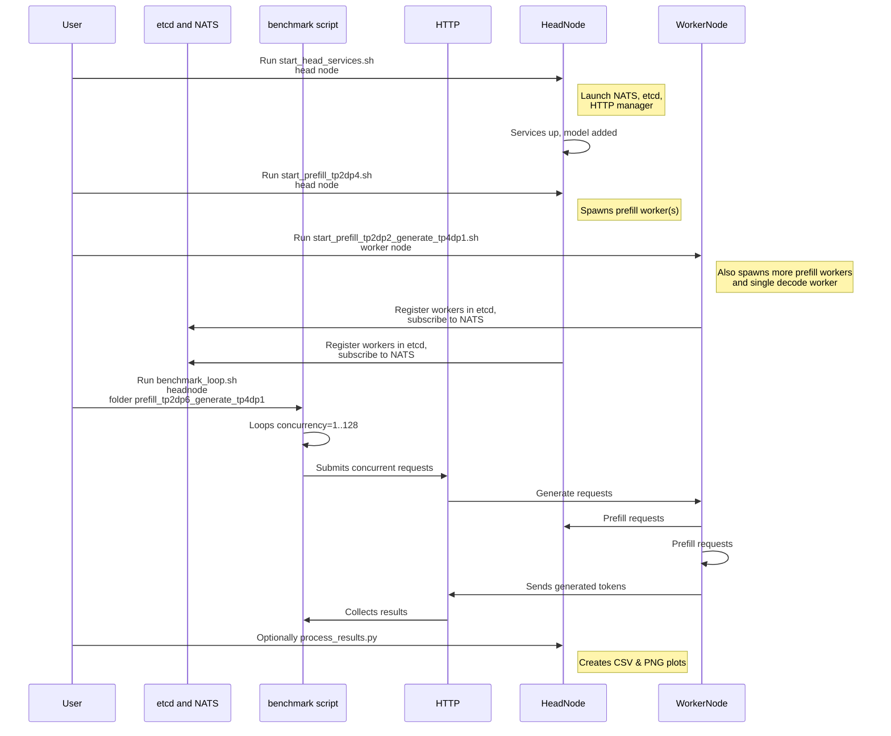

# Multi-Node Benchmarking Readme

This folder contains example scripts for running multi-node benchmarks with a *disaggregated* inference setup using vLLM on Dynamo (Nixl connectors). The general idea is:

- **One node** serves as the _head node_: it runs the required control-plane services (NATS, etcd, and the HTTP manager).
- **One or more worker nodes** run the actual _prefill_ and _decode_ workers for your model.
- **A benchmark driver script** sends concurrent or RPS-based loads to the head node's HTTP endpoint to measure throughput, latency, and other key metrics.

Below is a high-level sequence of how these scripts orchestrate services and workers across two nodes.




Below are instructions on script usage, a typical sequence of operations for a multi-node benchmark, and sample configurations (such as `prefill TP2DP6 + generate TP4DP1`).

---

## Scripts Overview

<details>
<summary><strong>start_head_services.sh</strong></summary>

- **Purpose**: Runs on your primary (head) node. Starts:
  1. **NATS** server at `<head-host>:4222`
  2. **etcd** server at `<head-host>:2379`
  3. **HTTP** server endpoint for model routing at `<head-host>:8080`
  4. Registers your model via `llmctl http add chat-models ...`.

- **Usage**:
  ```bash
  ./start_head_services.sh <endpoint-host>
  ```
  Where `<endpoint-host>` is a hostname or IP accessible by all worker nodes (e.g. `head-node1` or `10.10.10.1`).
</details>

<details>
<summary><strong>start_prefill_tp2dp4.sh / start_prefill_tp2dp2_generate_tp4dp1.sh / etc.</strong></summary>

- **Purpose**: Example scripts for launching **prefill workers** (and, optionally, decode workers) on each node.
- **Usage**: Typically run on each worker node **after** the head node services are available.
- **Example**:
  ```bash
  ./start_prefill_tp2dp2_generate_tp4dp1.sh <endpoint-host>
  ```
  This would start two separate prefill workers (TP=2, DP=2 total) and one decode worker (TP=4, DP=1) on the local node. Adjust the GPU mappings in the script to match your hardware.
</details>

<details>
<summary><strong>benchmark_loop.sh</strong></summary>

- **Purpose**: Runs a loop of concurrency-based tests (concurrency = 1, 2, 4, 8... up to 2^7=128, by default). This calls `benchmark.py` with the specified concurrency, sends the load to `<endpoint-host>:8080`, and stores JSON artifacts.
- **Usage**:
  ```bash
  ./benchmark_loop.sh <endpoint-host> <configuration-prefix>
  ```
  For example:
  ```bash
  ./benchmark_loop.sh head-node1 my_disagg_experiment
  ```
  This stores artifacts in `./artifacts/isl_shared_0_isl_unique_3000_osl_150/<configuration-prefix>/...`.
</details>

<details>
<summary><strong>benchmark.py</strong></summary>

- **Purpose**: Internal Python script that actually runs the load test using `genai-perf profile`. Waits for readiness and then executes a concurrency or RPS-based test. Normally, you don't call this directly if you're using `benchmark_loop.sh`, but you _can_ if you want more granular control.
</details>

<details>
<summary><strong>process_results.py</strong></summary>

- **Purpose**: Gathers all JSON artifacts from the `benchmark.py` runs and produces CSV and PNG plots (throughput, latency, Pareto, etc.).
- **Usage**:
  ```bash
  python3 process_results.py /path/to/artifacts "Your Title Here"
  ```
  The scripts like `bench_8GPUs_70B.sh` or `bench_2GPUs_8B.sh` normally invoke this automatically. For multi-node, you can do it manually once you have all concurrency results.
</details>

<details>
<summary><strong>Other helper scripts</strong></summary>

- **`multi_node/start_head_services.sh`**: Spawns NATS, etcd, and an HTTP manager on the head node.
- **`multi_node/*.sh`**: Different example scripts for single- or multi-node topologies.
</details>

---

## Example Benchmark Flow

This section shows how you might run a multi-node benchmark with **prefill** workers having `TP=2, DP=6` and a **decode** worker having `TP=4, DP=1` (total 12 GPUs used for prefill + 4 GPUs for decode = 16 GPUs).

> **Note**
> This scenario requires two nodes with 8 GPUs each (so total 16 GPUs).
> - Node0 (head node) runs the control-plane plus 3 prefill worker sets (6 GPUs) plus maybe the decode worker (4 GPUs)
> - Node1 runs the remaining 3 prefill worker sets (6 GPUs) if needed.
> Adjust the scripts and `CUDA_VISIBLE_DEVICES` lines to match your actual hardware.

### Step-by-Step

1. **On the Head Node** (Node0):

   ```bash
   bash benchmark/multi_node/start_head_services.sh node0
   ```

   - This starts NATS, etcd, and the HTTP server on `node0:8080`, registers your chosen model, etc.

2. **On the Head Node** (or Node0) **and** the Worker Node (Node1), start your prefill/worker scripts**.**

   For example, if you have a script named `start_prefill_tp2dp4.sh` (illustrative name) that:
   - Spawns 4 prefill worker sets (each TP=2, so 2 GPUs per worker, for a total of 8 GPUs to represent `DP=4`).
   Another example, if you have a script named `start_prefill_tp2dp2_generate_tp4dp1.sh` (illustrative name) that:
   - Spawns 2 prefill worker sets (each TP=2, so 2 GPUs per worker, for a total of 4 GPUs to represent `DP=2`) and 1 decode worker (TP=4, DP=1 => 4 GPUs

   You might do:

   **Node0**:
   ```bash
   bash benchmark/multi_node/start_prefill_tp2dp4.sh node0
   ```
   **Node1**:
   ```bash
   bash benchmark/multi_node/start_prefill_tp2dp2_generate_tp4dp1.sh node0
   ```
   Each script must be edited to match exactly how many prefill worker processes and how many GPUs you want on that node. Alternatively, some users place all decode workers on one node and all prefill workers on another. The scripts are a reference.

3. **Wait** a few seconds for http server to announce themselves to etcd + NATS.

4. **Run the Benchmarks**:

   ```bash
   # On Node0 or your local machine with Python:
   bash benchmark/multi_node/benchmark_loop.sh node0 prefill_tp2dp6_generate_tp4dp1
   ```
   - This will run concurrency = 1, 2, 4, 8... up to 2^7=128 by default.
   - Results get stored in `./artifacts/isl_shared_0_isl_unique_3000_osl_150/prefill_tp2dp6_generate_tp4dp1/`.

5. **(Optional) Process Results**:

   ```bash
   python3 benchmark/process_results.py ./artifacts/isl_shared_0_isl_unique_3000_osl_150/prefill_tp2dp6_generate_tp4dp1 \
       "Multi-node 16GPU TP2DP6/TP4DP1 Benchmark shared/unique tokens 0/3000/150"
   ```
   This creates CSV plus plots (Pareto, throughput vs concurrency, TTF token, etc.).

6. **Cleanup**:
   - On each node, `Ctrl+C` in your shell to kill the workers or do `pkill -f python3`.
   - On the head node, also kill the `nats-server` and `etcd` if needed.


## Typical Configurations

You can adjust the scripts for various topologies:

- **Disaggregated Prefill**: Many prefill workers with a small `max-num-seqs`.
- **Disaggregated Decode**: One or more decode workers with a large `max-model-len` parameter.
- **Tensor Parallel**: `TP=2,4,8...`, allocate that many GPUs for a single worker process.
- **Data Parallel**: `DP=2,4,6...`, replicate the same worker multiple times for parallel throughput.
- **Pipeline Parallel**: `PP=1` (or higher if you want pipeline parallel).

The scripts show how to set `CUDA_VISIBLE_DEVICES=...` to map each worker to a subset of GPUs.

---

## Notes and Tips

1. **Environment**: These scripts expect certain commands like `nats-server`, `etcd`, `llmctl`, and `http` on your PATH. Adjust accordingly or install them (they're often provided in the Dynamo container environment).
2. **Model**: The example uses a placeholder model name like `neuralmagic/DeepSeek-R1-Distill-Llama-70B-FP8-dynamic`. Change it to your real model if needed.
3. **GPU Allocation**: For large `TP*DP`, ensure you have enough GPUs. E.g., `TP=4, DP=2` means each node needs 8 GPUs for a single worker or for multiple workers, as specified. The scripts are references and can be adapted to HPC job schedulers (like Slurm) or static multi-node clusters.
4. **After Running**: If you want to run more tests, you can either keep the same workers alive and just re-run `benchmark_loop.sh` with a different prefix, or kill everything and start fresh.
