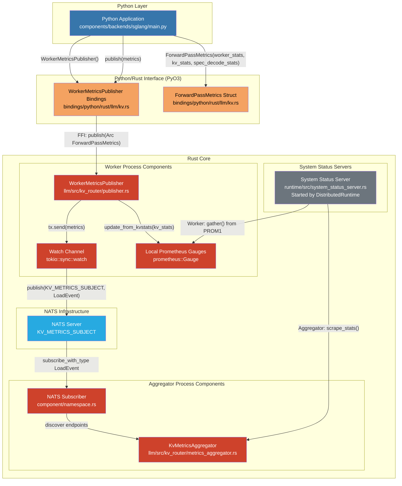
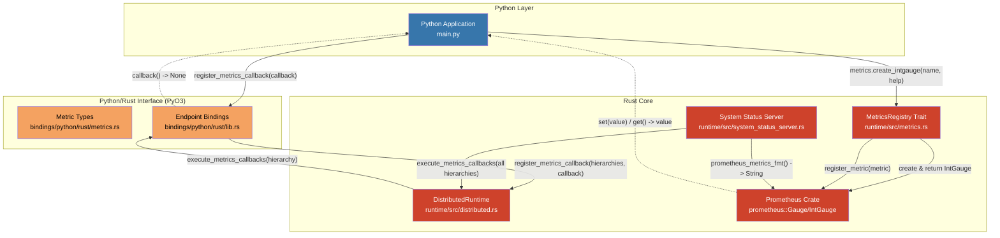
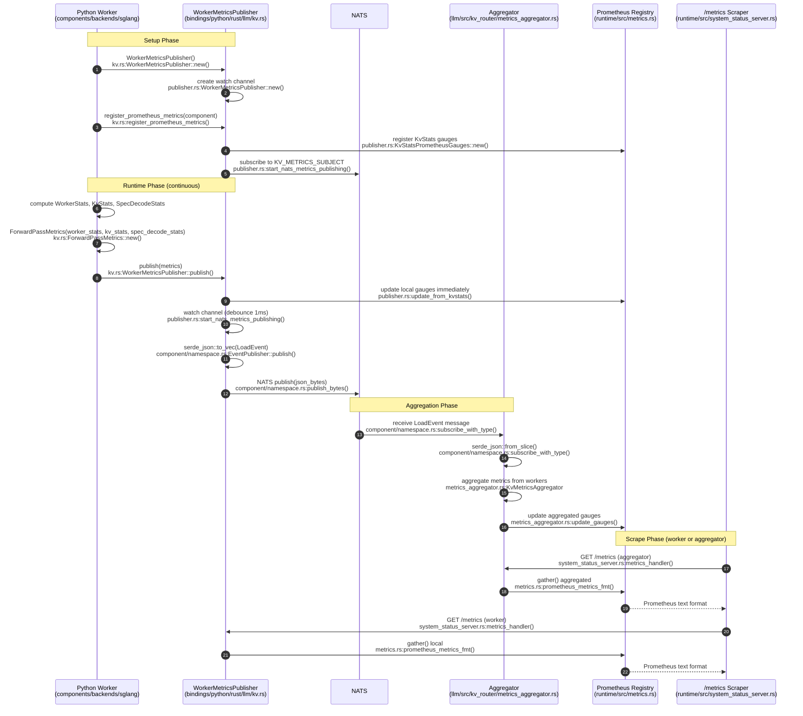
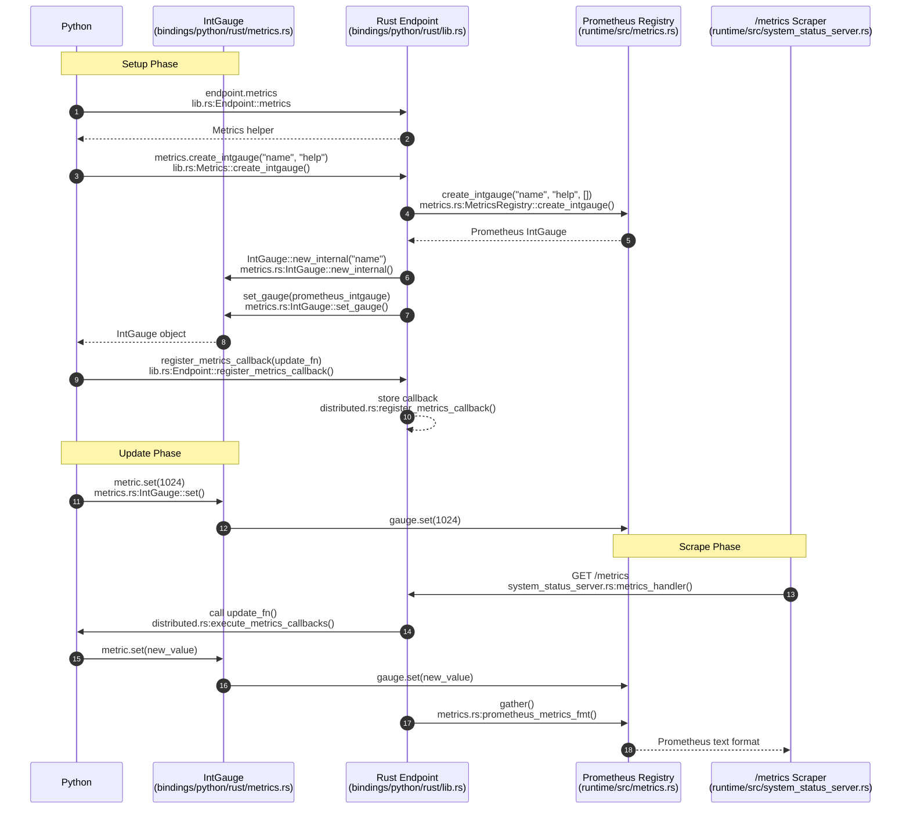

<!-- SPDX-FileCopyrightText: Copyright (c) 2025 NVIDIA CORPORATION & AFFILIATES. All rights reserved. -->
<!-- SPDX-License-Identifier: Apache-2.0 -->

# Python-Rust Metrics Integration

This directory demonstrates two methods for passing metrics between Python and Rust in the Dynamo runtime.

## Method 1: ForwardPassMetrics Pub/Sub via NATS (Legacy method for passing metrics)

Python maintains its own metrics dictionary, serializes it, and publishes to NATS. Rust subscribes to NATS, deserializes the metrics, and updates Prometheus gauges.

**Example**: Used by `WorkerMetricsPublisher` in production code

```python
from dynamo.llm import WorkerMetricsPublisher, ForwardPassMetrics

# Create publisher
publisher = WorkerMetricsPublisher()
await publisher.create_endpoint(component, metrics_labels)

# Python maintains its own metrics dict
metrics_dict = {
    "num_running_reqs": 5,
    "num_waiting_reqs": 10,
    "gpu_cache_usage": 0.75,
}

# Serialize and publish to NATS
metrics = ForwardPassMetrics(metrics_dict)
publisher.publish(metrics)

# Rust subscribes to NATS, deserializes, and updates Prometheus
```

### Adding/Changing Metrics in Method 1

When you need to add or modify metrics in Method 1 (ForwardPassMetrics Pub/Sub via NATS), you must update **multiple files**:

1. **`lib/llm/src/kv_router/protocols.rs`** - Add field to struct:
   ```rust
   pub struct WorkerStats {
       pub request_active_slots: u64,
       pub request_total_slots: u64,
       pub num_requests_waiting: u64,
       pub new_metric_field: u64,  // ADD THIS
   }
   ```

2. **`lib/llm/src/kv_router/publisher.rs`** - Manually create Prometheus gauge using DRT:
   ```rust
   fn new(component: &Component) -> Result<Self> {
       use dynamo_runtime::metrics::MetricsRegistry;

       // ... existing gauges ...

       // Manually create and register new Prometheus gauge
       let new_metric_gauge = component.create_gauge(
           "new_metric_name",
           "Description of new metric",
           &[],  // labels
       )?;

       // Store in struct
       Ok(KvStatsPrometheusGauges {
           kv_active_blocks_gauge,
           kv_total_blocks_gauge,
           gpu_cache_usage_gauge,
           gpu_prefix_cache_hit_rate_gauge,
           new_metric_gauge,  // ADD THIS
       })
   }
   ```

3. **`lib/llm/src/kv_router/publisher.rs`** - Update gauge in `update_from_kvstats()`:
   ```rust
   fn update_from_kvstats(&self, kv_stats: &KvStats) {
       // ... existing updates ...
       self.new_metric_gauge.set(worker_stats.new_metric_field as f64);
   }
   ```

4. **`components/backends/sglang/.../publisher.py`** - Update Python code to compute new metric:
   ```python
   def collect_metrics():
       worker_stats = WorkerStats(
           request_active_slots=...,
           new_metric_field=compute_new_metric(),  # ADD THIS
       )
   ```

**Result**: Changes require touching 3-4 files across Rust and Python codebases.

## Method 2: Dynamic Registration (New method for passing metrics)

Python creates typed metric objects using `endpoint.metrics.create_*()` methods, which automatically register with the endpoint. Python updates values through these objects using type-safe methods. Rust creates the underlying Prometheus metrics and calls Python callbacks before scraping.

**Example**: `server.py`

```python
# Create metric objects (automatically registered)
request_slots: IntGauge = endpoint.metrics.create_intgauge(
    "request_total_slots", "Total request slots available"
)
gpu_usage: Gauge = endpoint.metrics.create_gauge(
    "gpu_cache_usage_percent", "GPU cache usage percentage"
)

# Create vector metrics with labels
worker_requests: IntGaugeVec = endpoint.metrics.create_intgaugevec(
    "worker_active_requests",
    "Active requests per worker",
    ["worker_id", "model"]
)

# Create counters with constant label values
update_count: IntCounter = endpoint.metrics.create_intcounter(
    "internal_update_count",
    "Number of times metrics callback was invoked",
    [("type", "internal")]
)

# Register callback for dynamic updates before scraping
def update_metrics():
    request_slots.set(compute_slots())
    gpu_usage.set(compute_gpu_usage())
    update_count.inc()

endpoint.register_metrics_callback(update_metrics)

# Update vector metrics with specific label values
worker_requests.set(5, {"worker_id": "worker_1", "model": "llama-3"})
worker_requests.set(3, {"worker_id": "worker_2", "model": "llama-3"})
```

### Available Metric Types

Method 2 supports all standard Prometheus metric types:

- **Gauges**: `Gauge` (float), `IntGauge` (integer)
- **GaugeVec**: `GaugeVec` (float with labels), `IntGaugeVec` (integer with labels)
- **Counters**: `Counter` (float), `IntCounter` (integer)
- **CounterVec**: `CounterVec` (float with labels), `IntCounterVec` (integer with labels)
- **Histograms**: `Histogram`

All metrics are imported from `dynamo._prometheus_metrics`.

### Adding/Changing Metrics in Method 2

When you need to add or modify metrics in Method 2 (Dynamic Registration), you only update **Python code**:

1. **Create new metric** - Just add one line in Python (automatically registered):
   ```python
   new_metric: IntGauge = endpoint.metrics.create_intgauge(
       "new_metric_name", "Description of the metric"
   )
   ```

2. **Update in callback** - Add update logic:
   ```python
   def update_metrics():
       request_slots.set(compute_slots())
       gpu_usage.set(compute_gpu_usage())
       new_metric.set(compute_new_metric())  # ADD THIS
   ```

3. **For vector metrics with labels** - Create with label names, update with label values:
   ```python
   # Create vector metric
   new_vec: IntGaugeVec = endpoint.metrics.create_intgaugevec(
       "new_metric_vec", "Description", ["label1", "label2"]
   )

   # Update with specific label values
   new_vec.set(100, {"label1": "value1", "label2": "value2"})
   ```

**Result**: Changes only require modifying Python code. No Rust changes needed. Metrics are automatically created and registered with Prometheus by the Rust runtime when you call `create_*()`.

### Type-Safe Methods

Dynamic Registration provides type safety through typed metric classes:

- **Gauges** use `.set()`, `.get()`, `.inc()`, `.dec()`, `.add()`, `.sub()`
- **Counters** use `.inc()`, `.inc_by()`, `.get()` (counters only increase)
- **Histograms** use `.observe()`
- **Vec metrics** take a `labels: Dict[str, str]` parameter for operations

## Architecture Diagrams

### Component Architecture

#### Method 1: ForwardPassMetrics Pub/Sub via NATS - Component View



#### Method 2: Dynamic Registration - Component View



### Sequence Diagrams

#### Method 1: ForwardPassMetrics Pub/Sub via NATS



#### Method 2: Dynamic Registration



## Comparison

| Aspect | Method 1: ForwardPassMetrics Pub/Sub | Method 2: Dynamic Registration |
|--------|----------------------|------------------------|
| **Ownership** | Python owns metrics dict, Rust owns Prometheus objects | Python holds typed metric objects, Rust holds Prometheus objects |
| **Communication** | Indirect via NATS message broker | Direct Foreign Function Interface (callbacks from Rust to Python) |
| **Update Pattern** | Serialize entire dict and publish | Type-safe methods (`.set()`, `.inc()`, `.observe()`) on individual metric objects |
| **Serialization** | Serialize-Deserialize (JSON/MessagePack) to NATS | No serialization (direct FFI calls) |
| **Type Safety** | No type safety (dict with arbitrary keys/values) | Full type safety with typed metric classes (IntGauge, Gauge, Counter, etc.) |
| **Metric Types** | Limited to predefined struct fields | All Prometheus types: Gauge, IntGauge, Counter, IntCounter, Histogram, and Vec variants |
| **Label Support** | Fixed labels in struct definition | Dynamic labels via Vec metrics (GaugeVec, CounterVec, etc.) |
| **Overhead** | Medium (NATS network + serialization) | Lower (direct FFI, no serialization) |
| **Decoupling** | Loosely coupled (can run in different processes) | Tightly coupled (Python and Rust in same process) |
| **Scalability** | Multiple workers publish to same topic | Single worker only |
| **Flexibility** | Push-based, may have stale values | Callback ensures fresh values before scrape |
| **Complexity** | High (NATS setup, struct changes, Rust+Python) | Low (Python-only, simple API) |
| **Adding Metrics** | Modify 3-4 files (Rust structs + Python) | Single Python file only |
| **Use Case** | Distributed workers publishing to aggregator | Single-process services with dynamic updates |

## Running the Example

The `server.py` example demonstrates Method 2 (Dynamic Registration).

### Prerequisites

1. Build Python bindings:
   ```bash
   cd ~/dynamo/lib/bindings/python
   maturin develop
   ```

2. Install Python dependencies:
   ```bash
   uv pip install uvloop
   ```

### Run the Server

```bash
cd ~/dynamo/lib/bindings/python/examples/metrics
DYN_SYSTEM_ENABLED=true DYN_SYSTEM_PORT=8081 python server.py
```

### Check the Metrics

The metrics are served via the system status server. Access them at:

```bash
curl http://localhost:8081/metrics
```

Expected output includes:

```
# HELP request_total_slots Total request slots available
# TYPE request_total_slots gauge
request_total_slots{dynamo_namespace="ns556",dynamo_component="cp556",dynamo_endpoint="ep556"} 1024

# HELP gpu_cache_usage_percent GPU cache usage percentage
# TYPE gpu_cache_usage_percent gauge
gpu_cache_usage_percent{dynamo_namespace="ns556",dynamo_component="cp556",dynamo_endpoint="ep556"} 0.00

# HELP worker_active_requests Active requests per worker
# TYPE worker_active_requests gauge
worker_active_requests{dynamo_namespace="ns556",dynamo_component="cp556",dynamo_endpoint="ep556",worker_id="worker_1",model="llama-3"} 5
worker_active_requests{dynamo_namespace="ns556",dynamo_component="cp556",dynamo_endpoint="ep556",worker_id="worker_2",model="llama-3"} 3

# HELP internal_update_count Number of times metrics callback was invoked
# TYPE internal_update_count counter
internal_update_count{dynamo_namespace="ns556",dynamo_component="cp556",dynamo_endpoint="ep556",type="internal"} 1
```

Each time you query the `/metrics` endpoint, the `update_metrics()` callback is invoked, updating the metric values with fresh data.
